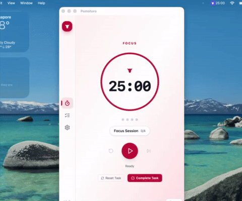

# Pomotoro 🍅🐂

**Pomodoro focus timer with task queues, automatic work/break cycling, and screen-blocking break enforcement. Built native with Rust + Tauri.**

*Charges through your work like a determined 🐂 Torro.*

Pomotoro pairs the Pomodoro Technique with task management, ambient focus audio, and
rich notifications in a fast, native desktop app. Everything runs locally — private
data, instant response, and a timer that keeps working even when you're deep in flow.

---

## 🎬 Demo

<p align="center">
  <a href="./demo.mp4" title="Watch the full demo">
    
  </a>
</p>
<p align="center"><em>A quick loop of Pomotoro in action — <a href="./demo.mp4">watch the full demo</a> (1m40s).<br>Timer phases, task queues, ambient audio, notifications, and the break screen blocker.</em></p>

---

## ✨ What it does

| | |
|---|---|
| 🍅 **Pomodoro engine** | Configurable focus / short-break / long-break cycles with smooth visual ring and session dots. |
| ✅ **Task management** | Multi-session tasks with tags, search, status filters, and live progress. A starter *Focus Session* is auto-created on first boot. |
| 🎵 **Focus audio** | Ambient background sounds (rain, forest, ocean, white noise, café, fireplace, thunderstorm, brown noise) plus distinct work/break notification chimes. |
| 🔔 **Smart notifications** | Desktop notifications, sound alerts, phase-transition & task-completion alerts, with position and auto-dismiss control. |
| 🚫 **Screen blocker** | Optional full-screen overlay that forces you to actually take your break — with custom messages. |
| 🪟 **System tray** | Minimize to tray, start minimized, and watch the live countdown baked into the tray icon & tooltip. |
| ⌨️ **Keyboard shortcuts** | Cycle incomplete tasks instantly with `Ctrl/Meta+Tab` — no mouse needed. |
| 🎛️ **Deeply configurable** | Timer durations, automation, appearance, window, audio, and screen blocking — all in one settings hub. |
| ⚡ **Native speed** | Tauri + Rust core with SQLite persistence. Minimal resources, instant response. |
| 🖥️ **Cross-platform** | Windows, macOS, and Linux |

---

## 🚀 Quick start

### Prerequisites

- **[Rust](https://rustup.rs/)** toolchain (latest stable)
- **[Node.js](https://nodejs.org/)** LTS (for the React frontend)
- **Build tools** (installed via Cargo):

```bash
cargo install just        # task runner — REQUIRED for all dev commands
cargo install tauri-cli   # desktop app packager

# Optional — database migration CLI (needs SQLite dev libs, see System Dependencies)
cargo install diesel_cli --no-default-features --features sqlite
```

### System dependencies

**Linux (recommended):** run the auto-detecting installer — supports Debian/Ubuntu,
Fedora/RHEL, Arch, and Alpine.

```bash
just install-deps        # or: ./scripts/install-deps.sh
```

<details>
<summary><strong>Manual Linux install</strong></summary>

```bash
# Debian / Ubuntu
sudo apt install libwebkit2gtk-4.1-dev build-essential curl wget file \
  libxdo-dev libssl-dev libayatana-appindicator3-dev librsvg2-dev \
  libsqlite3-dev libasound2-dev libgtk-3-dev libpango1.0-dev \
  libgdk-pixbuf2.0-dev libcairo2-dev libsoup-3.0-dev libjavascriptcoregtk-4.1-dev

# Fedora / RHEL
sudo dnf install webkit2gtk4.1-devel gtk3-devel sqlite-devel alsa-lib-devel \
  openssl-devel libayatana-appindicator-gtk3-devel librsvg2-devel

# Arch Linux
sudo pacman -S webkit2gtk-4.1 gtk3 sqlite alsa-lib openssl \
  libayatana-appindicator librsvg

# Alpine Linux
sudo apk add webkit2gtk-4.1-dev gtk+3.0-dev sqlite-dev alsa-lib-dev \
  openssl-dev libayatana-appindicator-dev librsvg-dev
```
</details>

- **macOS:** `xcode-select --install` (WebKit is bundled)
- **Windows:** [MSVC C++ Build Tools](https://visualstudio.microsoft.com/visual-cpp-build-tools/) + WebView2

### Run it

```bash
git clone <repository-url> && cd pomotoro
just dev                 # starts Vite + Tauri with hot-reload
```

The app opens automatically. Run `just` with no arguments to see every command.

---

## 🎮 Using Pomotoro

1. **Start** the timer — a default focus session is ready to go out of the box.
2. **Add tasks** — quick-add or open the detail modal for tags, descriptions, and a custom session count.
3. **Focus** — pick a task, hit play, and let ambient audio keep you in flow.
4. **Cycle tasks** instantly with `Ctrl/Meta+Tab`.
5. **Take your break** — the screen blocker (if enabled) makes sure you do.
6. **Tune everything** in **Settings → General / Timer / Notifications / Audio**.

### Timer controls
Start · Pause · Resume · Skip phase · Reset countdown · Reset task

---

## ⚙️ Configuration reference

All settings live in **Settings** and persist to local SQLite.

**⏱️ Timer**
- Focus, short-break, and long-break durations (minutes or seconds)
- Sessions until long break (2–10)

**🤖 Automation**
- Auto-start breaks after work
- Auto-start work after break
- Task cycling behavior: `Manual` or `AutoAdvance`

**🔔 Notifications**
- Desktop notifications toggle
- Sound notifications toggle
- Phase-transition alerts
- Task-completion alerts
- Auto-dismiss delay (1–300s)
- On-screen position (4 corners + center)

**🎵 Audio**
- Master mute / volume
- Ambient background audio during work (rain, forest, ocean, white noise, café, fireplace, thunderstorm, brown noise)
- Separate work & break notification sounds (bell, chime, ding, gentle-bell, wooden-block)
- In-app **Test** preview for every sound

**🎨 Appearance**
- Theme: System / Light / Dark

**🪟 Window & tray**
- Minimize to system tray
- Start minimized
- Show countdown in tray tooltip

**🚫 Screen blocking**
- Block screen after work (with custom message)
- Block screen after break (with custom message)

---

## 🛠️ Development

All tasks run through [`just`](./justfile). The most common ones:

| Command | Description |
|---|---|
| `just dev` / `dev-debug` / `dev-trace` | Dev server at info / debug / trace logging |
| `just build` | Production build (lints, formats, then bundles) |
| `just serve-react` | Frontend-only dev server (no Tauri) |
| `just test` | All tests |
| `just test-domain` / `test-usecases` / `test-infra` | Per-layer tests |
| `just ci` | Full gate: test, check, fmt, clippy, react lint+typecheck |
| `just check` · `just fmt` · `just clippy` · `just check-react` | Targeted checks |
| `just clean` | Remove build artifacts |
| `just install-deps` | Linux system dependencies |
| `just install-hooks` | Install git pre-commit hook |

<details>
<summary><strong>Falling back to cargo / npm</strong></summary>

| Command | Description |
|---|---|
| `cd apps/tauri-app && cargo tauri dev` | Dev server |
| `cd apps/tauri-app && cargo tauri build` | Production build |
| `cd apps/react-ui && npm run dev` | Frontend only |
| `cargo test --workspace` | All tests |
| `cargo fmt --all` · `cargo clippy --workspace` | Format / lint |

</details>

### Database migrations

```bash
cd core/infra
diesel migration run      # apply
diesel migration revert   # rollback last
diesel migration redo     # rollback + reapply
```

---

## 🏗️ Production builds

```bash
just build        # or: cd apps/tauri-app && cargo tauri build
```

Artifacts land in `target/release/bundle/`:
- **Linux:** `.deb` / `.AppImage`
- **macOS:** `.dmg`
- **Windows:** `.msi`

---

## 💡 Why Pomotoro?

Pomotoro exists because I wanted a native desktop app with the feature set above —
and nothing out there covered it cleanly without being Electron, closed-source, or
freemium. So I built it, and it's free (MIT).

It also happens to be a sandbox for exploring **Clean Architecture + DDD in Rust +
Tauri**, and for **agentic AI-assisted development**. Those shape the code but aren't
the reason the app exists.

Full story: **[docs/MOTIVATION.md](docs/MOTIVATION.md)**.

---

## 🧱 Architecture

Pomotoro follows **Clean Architecture + DDD**. The core engine is fully
framework-agnostic and reusable by any Rust client.

```
pomotoro/
├── core/                       # Framework-agnostic core engine
│   ├── domain/                 #   Business logic & entities (Task, Timer, Session, Config, Audio)
│   ├── usecases/               #   Application services (orchestrates domain)
│   └── infra/                  #   Infrastructure (repos, event bus, audio, timer tick)
│                               #   ⚠️ Zero Tauri dependencies — reusable by any client
└── apps/                       # Client applications (thin wrappers over core)
    ├── tauri-app/              #   Tauri desktop client (commands, plugins, UI emission)
    ├── react-ui/               #   React + TypeScript frontend (Vite)
    ├── pomotoro-cli/           #   CLI client (planned)
    └── cosmic-de/              #   Cosmic DE applet (planned)
```

**Dependency direction** (inward): UI → Infrastructure → Use Cases → Domain.

### Technology stack

- **Frontend:** [React](https://react.dev/) + TypeScript, bundled with [Vite](https://vite.dev/)
- **Backend:** [Tauri](https://tauri.app/) desktop shell
- **Languages:** Rust (core/backend) · TypeScript (frontend)
- **Persistence:** SQLite via [Diesel](https://diesel.rs/) ORM with r2d2 pooling
- **Async runtime:** Tokio

### Why two build tools (Vite + Tauri)?
**Vite** compiles the React/TypeScript frontend and serves hot-reload during dev.
**Tauri CLI** embeds those static assets into a native window, exposes system APIs
(notifications, tray, audio, screen blocking), and produces platform installers.
Think of it like building the electric motor (Vite) before assembling the car (Tauri).

---

## 🧯 Troubleshooting

| Symptom | Fix |
|---|---|
| `error: no such subcommand: tauri` | `cargo install tauri-cli` |
| `pkg-config exited with status code 1` | Missing GTK/Pango/GDK/ALSA/Soup libs — run `just install-deps` (Linux) |
| `library 'alsa' ... was not found` | Install `libasound2-dev` (Debian) / `alsa-lib-devel` (Fedora) |
| `library 'libsoup-3.0' was not found` | Install `libsoup-3.0-dev` |
| webkit2gtk build errors (Linux) | `sudo apt install libwebkit2gtk-4.1-dev libjavascriptcoregtk-4.1-dev libsoup-3.0-dev` |
| `-lsqlite3` not found during `diesel_cli` install | Install `libsqlite3-dev` (or `sqlite-devel` / `sqlite` / `sqlite-dev`) |
| Frontend "Failed to load module" | `cd apps/react-ui && rm -rf dist node_modules && npm install && npm run build` |

After installing missing system libraries, run `cargo clean` then rebuild.

---

## 🗺️ Roadmap

Planned features and direction. Items are exploratory and may shift based on
feedback and contributor interest.

**📊 Statistics** — session-history timelines, daily / weekly / monthly summaries,
streaks, per-task / tag / project breakdowns, charts & heatmaps, CSV / JSON export,
and daily or weekly focus-time goals.

**💻 Command-line interface** — drive Pomotoro from the terminal: status & timer
control (`start`, `pause`, `reset`, `skip`), task management, config access, a
headless daemon mode, and shell completions for bash / zsh / fish / PowerShell.

**⚡ Command hooks** — run user-defined shell commands on lifecycle events
(`timer.started`, `task.completed`, `phase.changed`, …) with templated arguments
(`{phase}`, `{task}`, `{duration_seconds}`), safe opt-in defaults, and a
diagnostics log view.

**🔭 Longer-term explorations** — end-to-end-encrypted cloud sync, a read-only
mobile companion, user-built themes & visualizations, a plugin system, and a local
focus-metrics API for integrations.

Full detail and latest status: **[ROADMAP.md](ROADMAP.md)**.

---

## 🤝 Contributing

1. **Fork** → `git checkout -b feature-name`
2. **Develop** — `just dev`, test with `just test`
3. **Verify** — `just ci` must pass before pushing
4. **Commit** with clear messages and open a pull request

See the [Roadmap](#-roadmap) for planned features, and
[docs/README.md](docs/README.md) for the full documentation index
(architecture, reference, coding standards, and workflows).

---

## 📜 License

MIT — see [LICENSE](LICENSE).

## 🙏 Acknowledgments

- 🍅 Inspired by the [Pomodoro Technique](https://francescocirillo.com/pages/pomodoro-technique) by Francesco Cirillo
- 🦀 Built with [Tauri](https://tauri.app/) and [React](https://react.dev/)
- 🐂 Powered by the strength and speed of Rust
