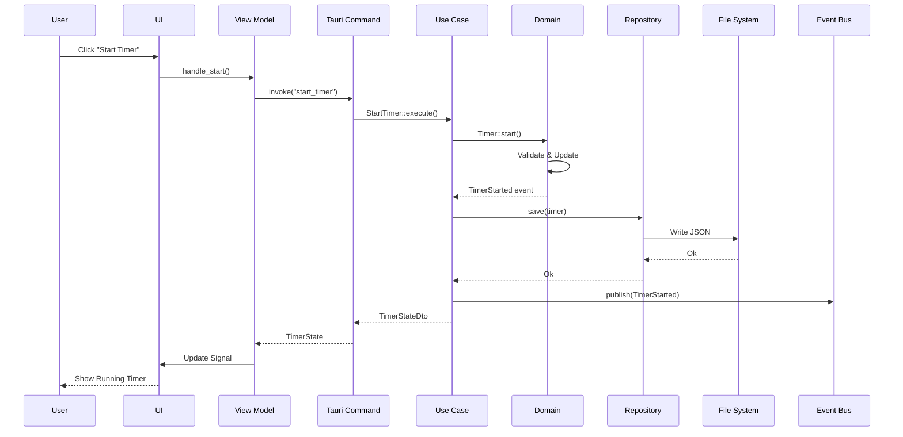
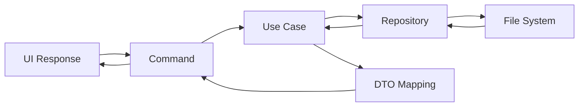
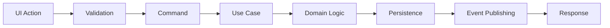
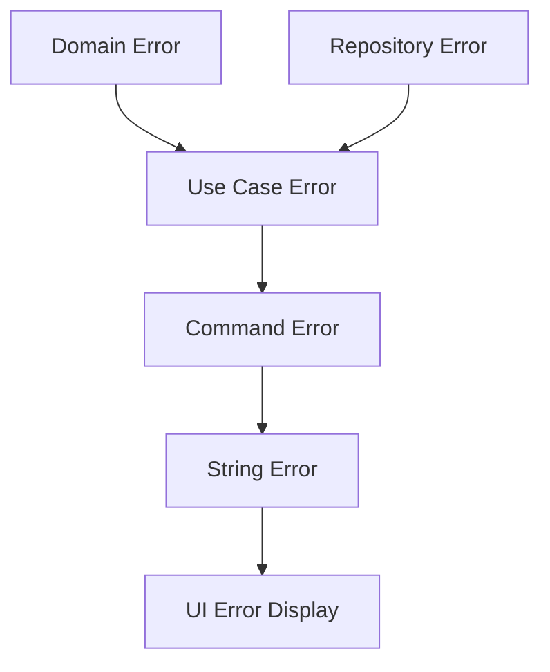
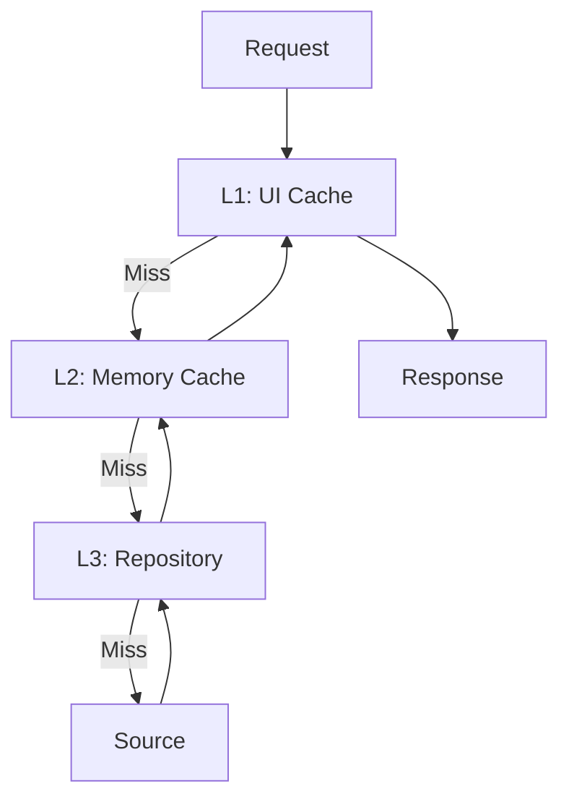

# 📊 Data Flow Through Layers

Understanding how data flows through the application layers is crucial for maintaining clean architecture.

## Complete Data Flow



## Layer-by-Layer Flow

### 1. UI to Command
User interaction triggers command invocation:

```tsx
// UI Layer (React Component) — apps/react-ui/src/pages/TimerPage.tsx
import { invoke } from "@tauri-apps/api/core";

export function TimerControls() {
    const startTimer = async () => {
        const result = await invoke("start_timer", { taskId: null });
        // update timer state from `result`
    };

    return <button onClick={startTimer}>Start</button>;
}
```

### 2. Command to Use Case
Commands delegate to use cases:

```rust
// Infrastructure Layer (Tauri Command)
#[tauri::command]
pub async fn start_timer(
    state: State<'_, AppState>,
    task_id: Option<String>,
) -> Result<TimerStateDto, String> {
    // Parse input
    let task_id = task_id
        .map(|id| TaskId::from_str(&id))
        .transpose()
        .map_err(|e| e.to_string())?;
    
    // Execute use case
    let use_case = state.start_timer_use_case();
    let result = use_case.execute(task_id).await
        .map_err(|e| e.to_string())?;
    
    // Return DTO
    Ok(result)
}
```

### 3. Use Case to Domain
Use cases orchestrate domain logic:

```rust
// Use Case Layer
pub struct StartTimerSession {
    timer_repository: Arc<dyn TimerRepository>,
    task_repository: Arc<dyn TaskRepository>,
    event_bus: Arc<dyn EventBus>,
}

impl StartTimerSession {
    pub async fn execute(&self, task_id: Option<TaskId>) -> Result<TimerStateDto> {
        // Load domain entities
        let mut timer = self.timer_repository.get_current().await?;
        let task = if let Some(id) = task_id {
            self.task_repository.find(id).await?
        } else {
            None
        };
        
        // Execute domain logic
        let event = timer.start(task.as_ref())?;
        
        // Persist changes
        self.timer_repository.save(&timer).await?;
        
        // Publish domain event
        self.event_bus.publish(event).await;
        
        // Map to DTO
        Ok(TimerStateDto::from(timer))
    }
}
```

### 4. Domain Logic
Pure business logic without external dependencies:

```rust
// Domain Layer
impl Timer {
    pub fn start(&mut self, task: Option<&Task>) -> Result<TimerStarted> {
        // Validate state
        match self.state {
            TimerState::Idle | TimerState::Paused => {},
            _ => return Err(DomainError::InvalidStateTransition),
        }
        
        // Update state
        self.state = TimerState::Running;
        self.started_at = Some(Timestamp::now());
        self.active_task = task.map(|t| t.id().clone());
        
        // Create domain event
        Ok(TimerStarted {
            timer_id: self.id.clone(),
            task_id: self.active_task.clone(),
            started_at: self.started_at.unwrap(),
        })
    }
}
```

## Data Transformation

### Domain to DTO
```rust
// Use Case Layer - Mappers
impl From<Timer> for TimerStateDto {
    fn from(timer: Timer) -> Self {
        Self {
            id: timer.id().to_string(),
            state: timer.state().to_string(),
            elapsed_seconds: timer.elapsed().as_secs(),
            remaining_seconds: timer.remaining().as_secs(),
            current_phase: timer.phase().to_string(),
            active_task_id: timer.active_task()
                .map(|id| id.to_string()),
        }
    }
}
```

### DTO to UI Model
```rust
// UI Layer - View Model
impl From<TimerStateDto> for TimerViewModel {
    fn from(dto: TimerStateDto) -> Self {
        Self {
            is_running: dto.state == "running",
            time_display: format_time(dto.remaining_seconds),
            phase_display: format_phase(&dto.current_phase),
            progress: calculate_progress(dto.elapsed_seconds, dto.total_seconds),
        }
    }
}
```

## Query Data Flow

### Simple Query


Example:
```rust
// Get all tasks
#[tauri::command]
pub async fn get_tasks(state: State<'_, AppState>) -> Result<Vec<TaskDto>, String> {
    state.get_tasks_use_case()
        .execute()
        .await
        .map_err(|e| e.to_string())
}

// Use case
pub async fn execute(&self) -> Result<Vec<TaskDto>> {
    let tasks = self.task_repository.list_all().await?;
    Ok(tasks.into_iter().map(TaskDto::from).collect())
}
```

### Complex Query with Joins
```rust
pub async fn execute(&self) -> Result<DashboardDto> {
    // Parallel data fetching
    let (timer, tasks, stats) = tokio::join!(
        self.timer_repository.get_current(),
        self.task_repository.list_active(),
        self.stats_repository.get_today()
    );
    
    // Combine data
    Ok(DashboardDto {
        timer_state: TimerStateDto::from(timer?),
        active_tasks: tasks?.into_iter().map(TaskDto::from).collect(),
        today_stats: StatsDto::from(stats?),
    })
}
```

## Command Data Flow

### Simple Command


### Command with Side Effects
```rust
pub async fn execute(&self, task_name: String) -> Result<TaskDto> {
    // Create domain entity
    let task = Task::new(task_name)?;
    
    // Persist
    self.task_repository.save(&task).await?;
    
    // Publish event
    self.event_bus.publish(TaskCreated {
        task_id: task.id().clone(),
        created_at: Timestamp::now(),
    }).await;
    
    // Send notification
    self.notification_service.notify(
        "Task created",
        &format!("Task '{}' has been created", task.name())
    ).await?;
    
    // Update statistics
    self.stats_service.increment_tasks_created().await?;
    
    // Return DTO
    Ok(TaskDto::from(task))
}
```

## Error Flow

### Error Propagation


Example:
```rust
// Domain error
#[derive(Error, Debug)]
pub enum DomainError {
    #[error("Invalid state transition")]
    InvalidStateTransition,
}

// Use case error
#[derive(Error, Debug)]
pub enum UseCaseError {
    #[error("Domain error: {0}")]
    Domain(#[from] DomainError),
    
    #[error("Repository error: {0}")]
    Repository(#[from] RepositoryError),
}

// Command error handling
#[tauri::command]
pub async fn some_command(state: State<'_, AppState>) -> Result<String, String> {
    state.use_case()
        .execute()
        .await
        .map_err(|e| match e {
            UseCaseError::Domain(DomainError::InvalidStateTransition) => 
                "Cannot perform this action in current state".to_string(),
            _ => format!("An error occurred: {}", e),
        })
}
```

## Async Data Flow

### Streaming Updates
```rust
// UI subscribes to updates
create_effect(move |_| {
    spawn_local(async move {
        let mut stream = subscribe_to_timer_updates().await;
        
        while let Some(update) = stream.next().await {
            timer_state.set(update);
        }
    });
});

// Backend publishes updates
pub async fn timer_tick_handler(&self) {
    loop {
        sleep(Duration::from_secs(1)).await;
        
        let state = self.get_current_state().await;
        self.broadcast_update(state).await;
    }
}
```

## Caching Strategy

### Multi-Level Cache


Implementation:
```rust
pub struct CachedTaskRepository {
    memory_cache: Arc<Cache<TaskId, Task>>,
    file_repository: Arc<FileTaskRepository>,
}

impl TaskRepository for CachedTaskRepository {
    async fn find(&self, id: TaskId) -> Result<Option<Task>> {
        // Check memory cache
        if let Some(task) = self.memory_cache.get(&id) {
            return Ok(Some(task));
        }
        
        // Load from file
        let task = self.file_repository.find(id.clone()).await?;
        
        // Update cache
        if let Some(ref t) = task {
            self.memory_cache.insert(id, t.clone());
        }
        
        Ok(task)
    }
}
```

## Best Practices

### Do's ✅
- Transform data at layer boundaries
- Use DTOs for external communication
- Keep domain models internal
- Handle errors at each layer
- Use async for I/O operations
- Cache frequently accessed data

### Don'ts ❌
- Don't expose domain models to UI
- Don't skip validation
- Don't mix layer responsibilities
- Don't ignore error handling
- Don't block on I/O
- Don't cache mutable state

## Next Steps
- Learn about [Event System](./events.md)
- Understand [Dependencies](./dependencies.md)
- See [Adding Features](../workflows/adding-a-feature.md)