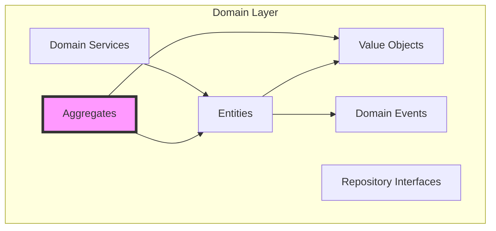

# 🎯 Domain Layer Guide

The domain layer is the **heart** of the application - pure business logic with zero external dependencies.

## Core Concepts



## Key Components

### 1. Entities
Entities have identity and lifecycle:
```rust
pub struct Timer {
    id: TimerId,
    state: TimerState,
    config: TimerConfiguration,
    current_phase: Phase,
    elapsed: Duration,
}
```

### 2. Value Objects
Immutable objects without identity:
```rust
#[derive(Clone, PartialEq)]
pub struct TaskId(Uuid);

#[derive(Clone)]
pub struct Timestamp {
    value: DateTime<Utc>,
}
```

### 3. Aggregates
Consistency boundaries:
- **Timer Aggregate**: Timer + TimerState + Phase
- **Task Aggregate**: Task + TaskStatus + Sessions
- **Config Aggregate**: Config + Settings

### 4. Domain Services
Complex operations spanning multiple entities:
```rust
pub trait TaskCyclingService {
    fn cycle_tasks(&self, queue: &[Task]) -> Result<Task>;
    fn should_auto_cycle(&self, task: &Task) -> bool;
}
```

### 5. Domain Events
Things that happened:
```rust
pub struct TimerStarted {
    pub timer_id: TimerId,
    pub started_at: Timestamp,
    pub phase: Phase,
}
```

## Working in the Domain Layer

### File Structure
```
domain/src/
├── timer/
│   ├── mod.rs           # Module exports
│   ├── timer.rs         # Timer entity
│   ├── state_machine.rs # State transitions
│   ├── transitions.rs   # Business rules
│   └── events/          # Timer events
├── task/
│   ├── mod.rs
│   ├── task.rs          # Task entity
│   ├── builder.rs       # Task builder
│   ├── repository.rs    # Repository trait
│   └── events/
├── config/
│   ├── mod.rs
│   ├── config.rs        # Config entity
│   └── repo.rs          # Repository trait
└── shared_kernel/       # Shared types
    ├── value_objects/
    ├── errors.rs
    └── traits/
```

### Creating a New Entity

1. **Define the Entity**
```rust
// domain/src/notification/notification.rs
pub struct Notification {
    id: NotificationId,
    message: String,
    level: NotificationLevel,
    created_at: Timestamp,
}

impl Notification {
    pub fn new(message: String, level: NotificationLevel) -> Self {
        Self {
            id: NotificationId::new(),
            message,
            level,
            created_at: Timestamp::now(),
        }
    }
    
    // Business methods
    pub fn is_critical(&self) -> bool {
        self.level == NotificationLevel::Critical
    }
}
```

2. **Add Value Objects**
```rust
// domain/src/notification/id.rs
#[derive(Clone, PartialEq)]
pub struct NotificationId(Uuid);

impl NotificationId {
    pub fn new() -> Self {
        Self(Uuid::new_v4())
    }
}
```

3. **Define Events**
```rust
// domain/src/notification/events/notification_created.rs
pub struct NotificationCreated {
    pub notification_id: NotificationId,
    pub message: String,
    pub level: NotificationLevel,
    pub created_at: Timestamp,
}
```

4. **Create Repository Interface**
```rust
// domain/src/notification/repository.rs
#[async_trait]
pub trait NotificationRepository {
    async fn save(&self, notification: Notification) -> Result<()>;
    async fn find(&self, id: NotificationId) -> Result<Option<Notification>>;
    async fn list_unread(&self) -> Result<Vec<Notification>>;
}
```

### Business Rules Examples

#### Timer State Machine
```rust
impl Timer {
    pub fn start(&mut self) -> Result<TimerStarted> {
        match self.state {
            TimerState::Idle | TimerState::Paused => {
                self.state = TimerState::Running;
                Ok(TimerStarted {
                    timer_id: self.id.clone(),
                    started_at: Timestamp::now(),
                })
            }
            _ => Err(DomainError::InvalidStateTransition)
        }
    }
}
```

#### Task Validation
```rust
impl Task {
    pub fn complete_session(&mut self) -> Result<TaskSessionCompleted> {
        if self.sessions_completed >= self.estimated_sessions {
            return Err(DomainError::TaskAlreadyComplete);
        }
        
        self.sessions_completed += 1;
        self.last_activity = Timestamp::now();
        
        Ok(TaskSessionCompleted {
            task_id: self.id.clone(),
            session_number: self.sessions_completed,
        })
    }
}
```

## Testing Domain Logic

### Unit Tests
```rust
#[cfg(test)]
mod tests {
    use super::*;

    #[test]
    fn timer_starts_from_idle() {
        let mut timer = Timer::new(test_config());
        
        let result = timer.start();
        
        assert!(result.is_ok());
        assert_eq!(timer.state(), TimerState::Running);
    }
    
    #[test]
    fn timer_cannot_start_when_running() {
        let mut timer = Timer::new(test_config());
        timer.start().unwrap();
        
        let result = timer.start();
        
        assert!(matches!(
            result,
            Err(DomainError::InvalidStateTransition)
        ));
    }
}
```

### Test Builders
```rust
// domain/src/task/test_builder.rs
pub struct TaskBuilder {
    name: String,
    estimated_sessions: u32,
    // ... other fields
}

impl TaskBuilder {
    pub fn new() -> Self {
        Self::default()
    }
    
    pub fn with_name(mut self, name: &str) -> Self {
        self.name = name.to_string();
        self
    }
    
    pub fn completed(mut self) -> Self {
        self.status = TaskStatus::Completed;
        self
    }
    
    pub fn build(self) -> Task {
        Task::new(self.name, self.estimated_sessions)
    }
}
```

## Best Practices

### Do's ✅
- Keep domain pure (no I/O, no frameworks)
- Use ubiquitous language from the business
- Encapsulate business rules in entities
- Make invalid states unrepresentable
- Use strong typing (TaskId vs Uuid)
- Write comprehensive unit tests

### Don'ts ❌
- Don't leak infrastructure concerns
- Don't use external libraries (except std)
- Don't make entities anemic
- Don't expose internal state directly
- Don't skip domain events
- Don't violate aggregate boundaries

## Common Patterns

### Factory Pattern
```rust
impl Task {
    pub fn create_work_task(name: String) -> Self {
        Self::new(name, TaskType::Work, Priority::Normal)
    }
    
    pub fn create_urgent_task(name: String) -> Self {
        Self::new(name, TaskType::Work, Priority::High)
    }
}
```

### Specification Pattern
```rust
pub trait Specification<T> {
    fn is_satisfied_by(&self, candidate: &T) -> bool;
}

pub struct ActiveTaskSpec;
impl Specification<Task> for ActiveTaskSpec {
    fn is_satisfied_by(&self, task: &Task) -> bool {
        task.status == TaskStatus::Active
    }
}
```

### Domain Service Pattern
```rust
pub struct PomodoroCalculator;

impl PomodoroCalculator {
    pub fn calculate_total_time(
        sessions: u32,
        work_duration: Duration,
        break_duration: Duration,
    ) -> Duration {
        let work_time = work_duration * sessions;
        let break_time = break_duration * (sessions - 1);
        work_time + break_time
    }
}
```

## Debugging Tips

1. **Use Debug Derives**
```rust
#[derive(Debug)]
pub struct Timer { ... }
```

2. **Add Logging Points**
```rust
pub fn transition(&mut self, event: Event) -> Result<()> {
    log::debug!("Timer transition: {:?} -> {:?}", self.state, event);
    // ...
}
```

3. **Create Test Fixtures**
```rust
pub fn test_timer() -> Timer {
    Timer::new(TimerConfiguration::default())
}
```

## Next Steps
- Understand [Use Cases Layer](./usecases-layer.md)
- Learn about [Domain Events](./events.md)
- See [Testing Guide](../workflows/testing.md)