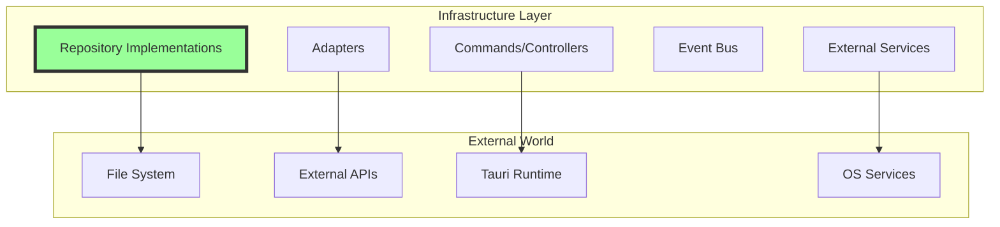

# 🔧 Infrastructure Layer Guide

The infrastructure layer handles all **external concerns**: databases, file systems, APIs, and frameworks.

## Purpose & Architecture



## Core Components

### 1. Repository Implementations
Concrete implementations of domain repository interfaces:
```rust
pub struct FileTaskRepository {
    base_path: PathBuf,
}

#[async_trait]
impl TaskRepository for FileTaskRepository {
    async fn save(&self, task: &Task) -> Result<()> {
        let path = self.base_path.join(format!("{}.json", task.id()));
        let json = serde_json::to_string_pretty(task)?;
        tokio::fs::write(path, json).await?;
        Ok(())
    }
    
    async fn find(&self, id: TaskId) -> Result<Option<Task>> {
        let path = self.base_path.join(format!("{}.json", id));
        if !path.exists() {
            return Ok(None);
        }
        let json = tokio::fs::read_to_string(path).await?;
        let task = serde_json::from_str(&json)?;
        Ok(Some(task))
    }
}
```

### 2. Adapters
Bridge between application and external services:
```rust
pub struct SystemNotificationAdapter {
    notifier: Notifier,
}

impl NotificationService for SystemNotificationAdapter {
    async fn send(&self, notification: &Notification) -> Result<()> {
        self.notifier
            .show_notification(
                notification.title(),
                notification.body(),
                notification.icon(),
            )
            .await?;
        Ok(())
    }
}
```

### 3. Tauri Commands
Entry points for the UI:
```rust
#[tauri::command]
pub async fn start_timer(
    state: State<'_, AppState>,
    task_id: Option<String>,
) -> Result<TimerStateDto, String> {
    let use_case = state.start_timer_use_case();
    let task_id = task_id.map(|id| TaskId::from_str(&id)).transpose()
        .map_err(|e| e.to_string())?;
    
    use_case.execute(task_id).await
        .map_err(|e| e.to_string())
}
```

### 4. Event Bus Implementation
```rust
pub struct MemoryEventBus {
    subscribers: Arc<RwLock<HashMap<TypeId, Vec<Handler>>>>,
}

impl EventBus for MemoryEventBus {
    async fn publish<E: Event>(&self, event: E) {
        let type_id = TypeId::of::<E>();
        let subscribers = self.subscribers.read().await;
        
        if let Some(handlers) = subscribers.get(&type_id) {
            for handler in handlers {
                handler.handle(Box::new(event.clone())).await;
            }
        }
    }
}
```

## File Structure

Persistence is **SQLite via Diesel** (with r2d2 pooling). The infra crate holds
adapters, repositories, and the event bus; Tauri commands live in the thin
`apps/tauri-app` wrapper.

```
core/infra/src/
├── adapters/
│   ├── audio/              # audio_service_adapter, library_service, asset_provider
│   ├── config/             # config adapter + event_handlers/
│   ├── database/           # connection.rs (r2d2 pool), models.rs, sqlite_config_repository.rs
│   ├── events/             # mem_event_bus, event_handler, event_subscriber, emitters
│   ├── notifications/      # service.rs + event_handlers.rs
│   ├── task/               # sqlite_repository.rs + event_handlers/
│   └── timer/              # sqlite_repository.rs, sqlite_service.rs, timer_dto.rs + event_handlers/
├── bin/                    # test_db.rs (DB inspection tooling)
├── bootstrap.rs            # AppState wiring / dependency injection
├── schema.rs               # Diesel schema (generated)
└── lib.rs

apps/tauri-app/src/
├── adapters/               # emitter.rs, notification_service.rs (Tauri-side bridges)
├── commands/               # Tauri #[tauri::command] handlers
├── tray.rs                 # System tray integration
└── lib.rs / main.rs        # App entry + invoke_handler registration
```

> The illustrative repository/adapter examples below use generic names
> (`FileTaskRepository`, `SmtpEmailAdapter`) to demonstrate the patterns. The
> real implementations are `Sqlite*Repository` types — see
> [reference/module-map](../reference/module-map.md) for the exact file list.

## Creating Infrastructure Components

### Implementing a Repository
```rust
// infra/src/adapters/notification/file_repo.rs
use domain::notification::{Notification, NotificationRepository};

pub struct FileNotificationRepository {
    data_dir: PathBuf,
}

impl FileNotificationRepository {
    pub fn new(data_dir: PathBuf) -> Self {
        Self { data_dir }
    }
    
    fn notification_path(&self, id: &NotificationId) -> PathBuf {
        self.data_dir
            .join("notifications")
            .join(format!("{}.json", id))
    }
}

#[async_trait]
impl NotificationRepository for FileNotificationRepository {
    async fn save(&self, notification: Notification) -> Result<()> {
        let path = self.notification_path(notification.id());
        
        // Ensure directory exists
        if let Some(parent) = path.parent() {
            tokio::fs::create_dir_all(parent).await?;
        }
        
        // Serialize and save
        let json = serde_json::to_string_pretty(&notification)?;
        tokio::fs::write(path, json).await?;
        
        Ok(())
    }
    
    async fn find(&self, id: NotificationId) -> Result<Option<Notification>> {
        let path = self.notification_path(&id);
        
        if !path.exists() {
            return Ok(None);
        }
        
        let json = tokio::fs::read_to_string(path).await?;
        let notification = serde_json::from_str(&json)?;
        Ok(Some(notification))
    }
}
```

### Creating an Adapter
```rust
// infra/src/adapters/email/smtp_adapter.rs
pub struct SmtpEmailAdapter {
    client: SmtpClient,
    from_address: String,
}

impl SmtpEmailAdapter {
    pub fn new(config: EmailConfig) -> Result<Self> {
        let client = SmtpClient::new(&config.server, config.port)?
            .credentials(config.username, config.password);
        
        Ok(Self {
            client,
            from_address: config.from_address,
        })
    }
}

#[async_trait]
impl EmailService for SmtpEmailAdapter {
    async fn send_email(&self, to: &str, subject: &str, body: &str) -> Result<()> {
        let email = Email::builder()
            .from(self.from_address.parse()?)
            .to(to.parse()?)
            .subject(subject)
            .body(body)
            .build()?;
            
        self.client.send(email).await?;
        Ok(())
    }
}
```

### Adding Tauri Commands
```rust
// infra/src/commands/notification_cmd.rs
#[tauri::command]
pub async fn send_notification(
    state: State<'_, AppState>,
    message: String,
    level: String,
) -> Result<(), String> {
    let use_case = state.send_notification_use_case();
    let level = NotificationLevel::from_str(&level)
        .map_err(|e| e.to_string())?;
    
    use_case.execute(message, level).await
        .map_err(|e| e.to_string())
}

#[tauri::command]
pub async fn get_notifications(
    state: State<'_, AppState>,
) -> Result<Vec<NotificationDto>, String> {
    let use_case = state.get_notifications_use_case();
    use_case.execute().await
        .map_err(|e| e.to_string())
}
```

## Dependency Injection

### Bootstrap Pattern
```rust
// infra/src/bootstrap.rs
pub struct AppState {
    // Repositories
    task_repository: Arc<dyn TaskRepository>,
    timer_repository: Arc<dyn TimerRepository>,
    config_repository: Arc<dyn ConfigRepository>,
    
    // Services
    notification_service: Arc<dyn NotificationService>,
    audio_service: Arc<dyn AudioService>,
    
    // Event Bus
    event_bus: Arc<dyn EventBus>,
    
    // Use Cases
    start_timer: Arc<StartTimerSession>,
    create_task: Arc<CreateTask>,
}

impl AppState {
    pub fn new(config: AppConfig) -> Result<Self> {
        // Create repositories
        let task_repository = Arc::new(
            FileTaskRepository::new(config.data_dir.join("tasks"))
        );
        let timer_repository = Arc::new(
            FileTimerRepository::new(config.data_dir.join("timer"))
        );
        
        // Create services
        let notification_service = Arc::new(
            SystemNotificationAdapter::new()
        );
        
        // Create event bus
        let event_bus = Arc::new(MemoryEventBus::new());
        
        // Create use cases
        let start_timer = Arc::new(StartTimerSession::new(
            timer_repository.clone(),
            event_bus.clone(),
        ));
        
        Ok(Self {
            task_repository,
            timer_repository,
            notification_service,
            event_bus,
            start_timer,
            // ...
        })
    }
}
```

## Testing Infrastructure

### Repository Tests
```rust
#[tokio::test]
async fn file_repository_saves_and_loads_task() {
    let temp_dir = tempfile::tempdir().unwrap();
    let repo = FileTaskRepository::new(temp_dir.path().to_path_buf());
    
    let task = Task::new("Test Task".to_string());
    
    // Save
    repo.save(&task).await.unwrap();
    
    // Load
    let loaded = repo.find(task.id()).await.unwrap();
    
    assert_eq!(loaded, Some(task));
}
```

### Adapter Tests
```rust
#[tokio::test]
async fn notification_adapter_sends_system_notification() {
    let adapter = SystemNotificationAdapter::new();
    let notification = Notification::new(
        "Test".to_string(),
        "Test message".to_string(),
    );
    
    let result = adapter.send(&notification).await;
    
    assert!(result.is_ok());
}
```

### Integration Tests
```rust
#[tokio::test]
async fn complete_workflow_integration() {
    let state = AppState::new(test_config()).unwrap();
    
    // Create task via command
    let task_dto = create_task(
        State(state.clone()),
        "Integration Test".to_string(),
        4,
    ).await.unwrap();
    
    // Start timer via command
    let timer_state = start_timer(
        State(state.clone()),
        Some(task_dto.id),
    ).await.unwrap();
    
    assert_eq!(timer_state.status, "running");
}
```

## Error Handling

### Infrastructure Errors
```rust
#[derive(Debug, thiserror::Error)]
pub enum InfrastructureError {
    #[error("IO error: {0}")]
    Io(#[from] std::io::Error),
    
    #[error("Serialization error: {0}")]
    Serialization(#[from] serde_json::Error),
    
    #[error("Database error: {0}")]
    Database(String),
    
    #[error("External service error: {0}")]
    ExternalService(String),
}
```

### Error Conversion
```rust
impl From<InfrastructureError> for String {
    fn from(error: InfrastructureError) -> Self {
        error.to_string()
    }
}

// In Tauri commands
#[tauri::command]
pub async fn some_command(state: State<'_, AppState>) -> Result<String, String> {
    state.some_use_case()
        .execute()
        .await
        .map_err(|e: InfrastructureError| e.to_string())
}
```

## Configuration Management

### Config Loading
```rust
pub struct ConfigLoader {
    config_path: PathBuf,
}

impl ConfigLoader {
    pub fn load(&self) -> Result<AppConfig> {
        if self.config_path.exists() {
            let content = fs::read_to_string(&self.config_path)?;
            Ok(toml::from_str(&content)?)
        } else {
            Ok(AppConfig::default())
        }
    }
    
    pub fn save(&self, config: &AppConfig) -> Result<()> {
        let content = toml::to_string_pretty(config)?;
        fs::write(&self.config_path, content)?;
        Ok(())
    }
}
```

## Best Practices

### Do's ✅
- Implement domain interfaces faithfully
- Handle all external errors
- Use async/await for I/O operations
- Add retry logic for network calls
- Log infrastructure operations
- Write integration tests

### Don'ts ❌
- Don't leak infrastructure details to domain
- Don't put business logic in adapters
- Don't skip error handling
- Don't hardcode configuration
- Don't create tight coupling
- Don't bypass the use case layer

## Performance Tips

### Connection Pooling
```rust
pub struct DatabaseAdapter {
    pool: Arc<Pool>,
}

impl DatabaseAdapter {
    pub fn new(config: DbConfig) -> Result<Self> {
        let pool = Pool::builder()
            .max_connections(config.max_connections)
            .build(config.connection_string)?;
        
        Ok(Self { pool: Arc::new(pool) })
    }
}
```

### Caching
```rust
pub struct CachedTaskRepository {
    inner: Arc<dyn TaskRepository>,
    cache: Arc<Cache<TaskId, Task>>,
}

impl TaskRepository for CachedTaskRepository {
    async fn find(&self, id: TaskId) -> Result<Option<Task>> {
        if let Some(task) = self.cache.get(&id) {
            return Ok(Some(task));
        }
        
        let task = self.inner.find(id.clone()).await?;
        if let Some(ref t) = task {
            self.cache.insert(id, t.clone());
        }
        
        Ok(task)
    }
}
```

## Next Steps
- Review the [Architecture Overview](./overview.md)
- Learn about [Event System](./events.md)
- See [Adding Features](../workflows/adding-a-feature.md)