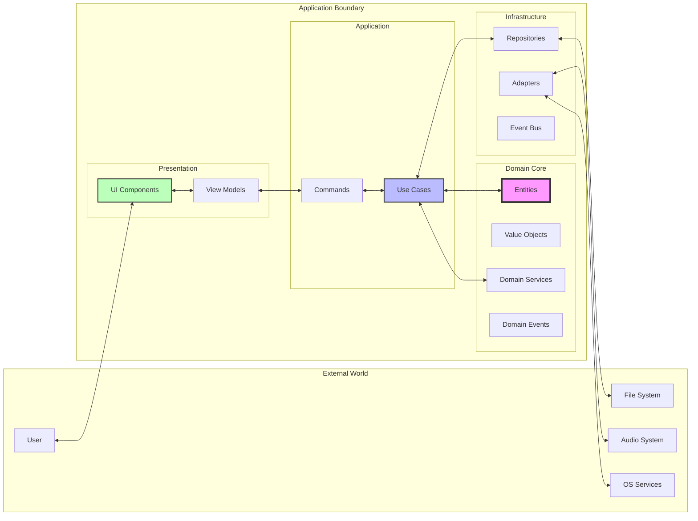
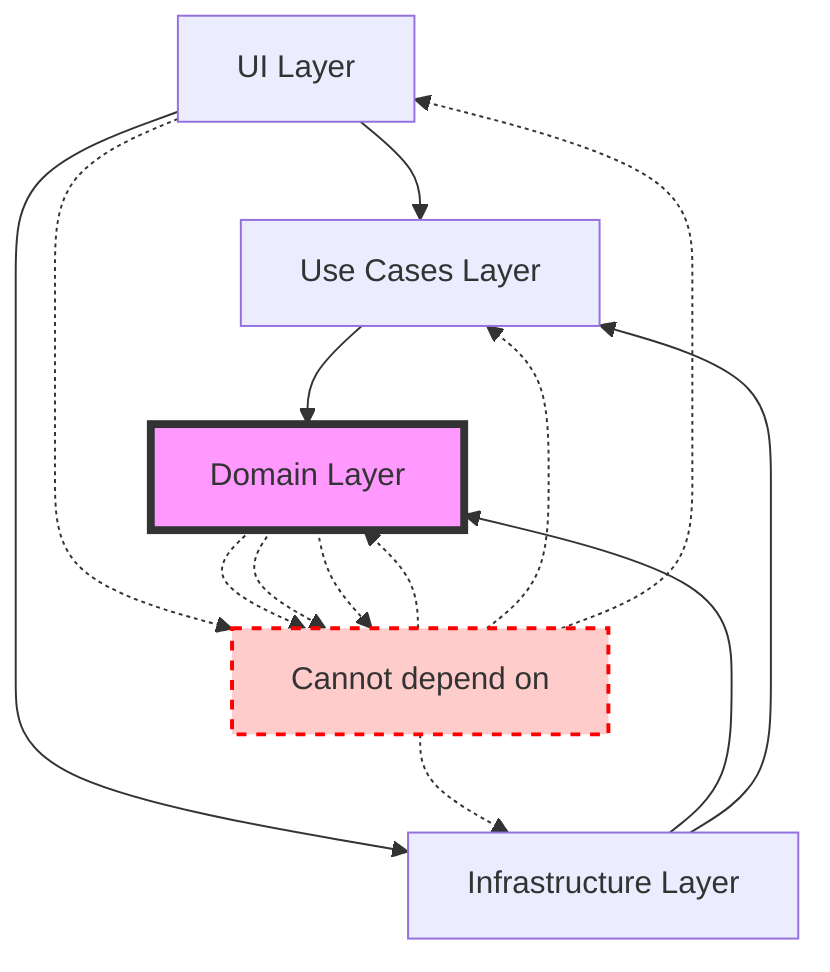
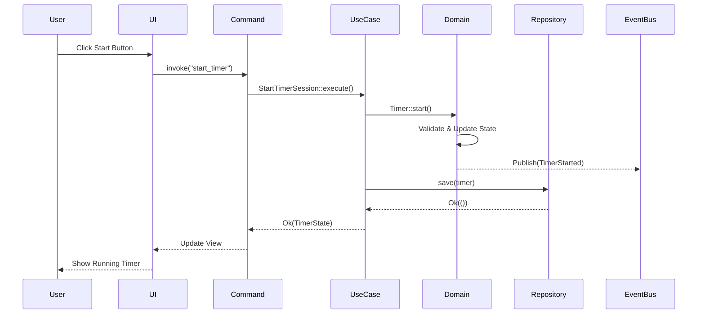

# 🏛️ Architecture Overview

## Technology Stack

- **Frontend:** [React](https://react.dev/) + TypeScript, bundled with [Vite](https://vite.dev/)
- **Backend / desktop shell:** [Tauri](https://tauri.app/)
- **Core language:** Rust (framework-agnostic `core/` engine)
- **Persistence:** SQLite via [Diesel](https://diesel.rs/) ORM with r2d2 connection pooling
- **Audio:** `rodio` for playback
- **Async runtime:** Tokio
- **Build:** Cargo workspace + Tauri CLI; all tasks wrapped in [`just`](../../justfile)

## Core Features at a Glance

- **Timer** — configurable work / short-break / long-break cycles, state machine, pause/skip/reset
- **Tasks** — multi-session tasks, status tracking, cycling strategies, search & filters
- **Audio** — ambient background sounds + phase-transition notification chimes
- **Configuration** — general, audio, notifications, appearance, window/tray, screen-blocking
- **Events** — domain events drive loose coupling (timer, task, session, app lifecycle events)

See the [feature docs](../reference/features/) for per-feature design notes.

## Clean Architecture Principles

Pomotoro follows **Clean Architecture** principles with a clear separation of concerns:



## The Four Layers

### 1. Domain Layer (`domain/`)
**The Heart of the Application**
- Pure business logic
- No external dependencies
- Contains:
  - Entities (Timer, Task, Config)
  - Value Objects (TaskId, Timestamp)
  - Domain Events
  - Domain Services
  - Repository Interfaces

### 2. Use Cases Layer (`usecases/`)
**Application Business Rules**
- Orchestrates domain entities
- Implements application-specific logic
- Contains:
  - Use case implementations
  - Data mappers
  - Service interfaces

### 3. Infrastructure Layer (`infra/`)
**External World Integration**
- Implements repository interfaces
- Handles external services
- Contains:
  - File repositories
  - Memory repositories
  - Event bus implementation
  - Audio service adapters
  - Tauri command handlers

### 4. UI Layer (`apps/react-ui/`)
**User Interface**
- React + TypeScript components
- View models
- State management
- User interaction handling

## Dependency Rules



### The Dependency Rule
Dependencies only point **inward**:
- Domain knows nothing about outer layers
- Use Cases know Domain but not Infrastructure/UI
- Infrastructure and UI can know about inner layers

## Key Architectural Patterns

### 1. Repository Pattern
```rust
// Domain defines interface
trait TaskRepository {
    fn save(&self, task: Task) -> Result<()>;
    fn find(&self, id: TaskId) -> Result<Option<Task>>;
}

// Infrastructure implements
struct FileTaskRepository { ... }
impl TaskRepository for FileTaskRepository { ... }
```

### 2. Event-Driven Architecture
```rust
// Domain event
struct TaskCompleted {
    task_id: TaskId,
    completed_at: Timestamp,
}

// Event handling
EventBus::publish(TaskCompleted { ... });
```

### 3. Command Pattern
```rust
// Tauri command
#[tauri::command]
async fn start_timer(state: State<'_, AppState>) -> Result<()> {
    let use_case = StartTimerSession::new(state.timer_service());
    use_case.execute().await
}
```

## Module Organization

```
pomotoro/
├── core/                       # Framework-agnostic core engine
│   ├── domain/                 #   Business logic & entities (Timer, Task, Config, Audio)
│   │   ├── timer/  task/  config/  audio/  shared_kernel/  event_names/
│   ├── usecases/               #   Application services (orchestrates domain)
│   │   └── timer/  task/  config/  audio/
│   └── infra/                  #   Adapters, SQLite repos, event bus (zero Tauri deps)
│       └── adapters/{database, timer, task, config, audio, notifications, events}
└── apps/                       # Client applications (thin wrappers over core)
    ├── tauri-app/              #   Tauri desktop client (commands, tray, UI emission)
    └── react-ui/               #   React + TypeScript frontend (Vite)
```

See the [Module Map](../reference/module-map.md) for the full file-by-file breakdown.

## Data Flow Example

Let's trace a "Start Timer" action:



## Testing Strategy

Each layer has its own testing approach:

1. **Domain**: Unit tests with in-memory implementations
2. **Use Cases**: Integration tests with test doubles
3. **Infrastructure**: Integration tests with real services
4. **UI**: Component tests and E2E tests

## Next Steps

Now that you understand the architecture:
1. Read [Getting Started](../getting-started.md) to set up your environment
2. Explore specific layer guides: [Domain](./domain-layer.md) · [Use Cases](./usecases-layer.md) · [Infrastructure](./infra-layer.md)
3. Learn about [Data Flow](./data-flow.md)