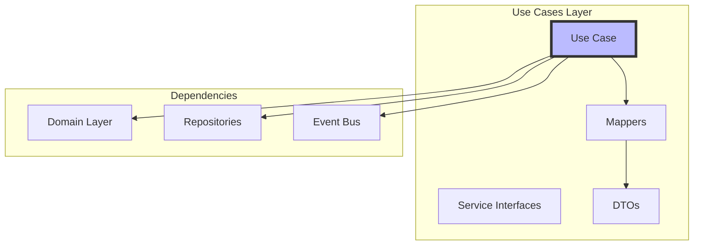

# 🎮 Use Cases Layer Guide

The use cases layer contains **application-specific business rules** that orchestrate the domain layer.

## Purpose & Principles



## Core Components

### 1. Use Case Pattern
Each use case represents a single user action:
```rust
pub struct StartTimerSession {
    timer_repository: Arc<dyn TimerRepository>,
    event_bus: Arc<dyn EventBus>,
}

impl StartTimerSession {
    pub async fn execute(&self, task_id: Option<TaskId>) -> Result<TimerState> {
        // 1. Load aggregate
        let mut timer = self.timer_repository.get_current().await?;
        
        // 2. Execute domain logic
        let event = timer.start(task_id)?;
        
        // 3. Save state
        self.timer_repository.save(&timer).await?;
        
        // 4. Publish events
        self.event_bus.publish(event).await;
        
        // 5. Return result
        Ok(timer.into())
    }
}
```

### 2. Data Transfer Objects (DTOs)
Bridge between layers:
```rust
pub struct TaskDto {
    pub id: String,
    pub name: String,
    pub status: String,
    pub sessions_completed: u32,
    pub estimated_sessions: u32,
}
```

### 3. Mappers
Convert between domain and DTOs:
```rust
impl From<Task> for TaskDto {
    fn from(task: Task) -> Self {
        Self {
            id: task.id().to_string(),
            name: task.name().to_string(),
            status: task.status().to_string(),
            sessions_completed: task.sessions_completed(),
            estimated_sessions: task.estimated_sessions(),
        }
    }
}
```

## File Structure
```
usecases/src/
├── timer/
│   ├── mod.rs
│   ├── start_session.rs      # Start timer use case
│   ├── pause_session.rs      # Pause timer use case
│   ├── reset_session.rs      # Reset timer use case
│   ├── skip_timer_phase.rs   # Skip phase use case
│   ├── get_timer_state.rs    # Query timer state
│   └── service.rs            # Timer service interface
├── task/
│   ├── mod.rs
│   ├── create_task.rs        # Create task use case
│   ├── update_task.rs        # Update task use case
│   ├── complete_session.rs   # Complete task session
│   ├── get_task_queue.rs     # Query task queue
│   └── mappers.rs            # Task DTO mappers
├── config/
│   ├── mod.rs
│   ├── get_config.rs         # Get configuration
│   ├── update_config.rs      # Update configuration
│   └── reset_config.rs       # Reset to defaults
└── bootstrap.rs              # Use case initialization
```

## Creating a New Use Case

### Step 1: Define the Use Case
```rust
// usecases/src/notification/send_notification.rs
use domain::notification::{Notification, NotificationRepository};

pub struct SendNotification {
    notification_repo: Arc<dyn NotificationRepository>,
    notification_service: Arc<dyn NotificationService>,
}

impl SendNotification {
    pub fn new(
        notification_repo: Arc<dyn NotificationRepository>,
        notification_service: Arc<dyn NotificationService>,
    ) -> Self {
        Self {
            notification_repo,
            notification_service,
        }
    }
    
    pub async fn execute(&self, message: String, level: NotificationLevel) -> Result<()> {
        // Create domain entity
        let notification = Notification::new(message.clone(), level);
        
        // Save to repository
        self.notification_repo.save(notification.clone()).await?;
        
        // Send via service
        self.notification_service.send(&notification).await?;
        
        Ok(())
    }
}
```

### Step 2: Create DTOs
```rust
// usecases/src/notification/dto.rs
#[derive(Serialize, Deserialize)]
pub struct NotificationDto {
    pub id: String,
    pub message: String,
    pub level: String,
    pub created_at: String,
}

impl From<Notification> for NotificationDto {
    fn from(notif: Notification) -> Self {
        Self {
            id: notif.id().to_string(),
            message: notif.message().to_string(),
            level: notif.level().to_string(),
            created_at: notif.created_at().to_rfc3339(),
        }
    }
}
```

### Step 3: Define Service Interface
```rust
// usecases/src/notification/service.rs
#[async_trait]
pub trait NotificationService {
    async fn send(&self, notification: &Notification) -> Result<()>;
    async fn schedule(&self, notification: Notification, at: DateTime<Utc>) -> Result<()>;
}
```

## Common Use Case Patterns

### Query Use Case
```rust
pub struct GetTimerState {
    timer_repository: Arc<dyn TimerRepository>,
}

impl GetTimerState {
    pub async fn execute(&self) -> Result<TimerStateDto> {
        let timer = self.timer_repository.get_current().await?;
        Ok(TimerStateDto::from(timer))
    }
}
```

### Command Use Case
```rust
pub struct CompleteTask {
    task_repository: Arc<dyn TaskRepository>,
    event_bus: Arc<dyn EventBus>,
}

impl CompleteTask {
    pub async fn execute(&self, task_id: TaskId) -> Result<()> {
        let mut task = self.task_repository
            .find(task_id)
            .await?
            .ok_or(UseCaseError::TaskNotFound)?;
        
        let event = task.complete()?;
        
        self.task_repository.save(task).await?;
        self.event_bus.publish(event).await;
        
        Ok(())
    }
}
```

### Orchestration Use Case
```rust
pub struct StartPomodoroWorkflow {
    start_timer: Arc<StartTimerSession>,
    activate_task: Arc<ActivateTask>,
    send_notification: Arc<SendNotification>,
}

impl StartPomodoroWorkflow {
    pub async fn execute(&self, task_id: TaskId) -> Result<()> {
        // Activate task
        self.activate_task.execute(task_id.clone()).await?;
        
        // Start timer
        self.start_timer.execute(Some(task_id)).await?;
        
        // Send notification
        self.send_notification.execute(
            "Pomodoro started!".to_string(),
            NotificationLevel::Info,
        ).await?;
        
        Ok(())
    }
}
```

## Testing Use Cases

### Unit Tests with Mocks
```rust
#[cfg(test)]
mod tests {
    use super::*;
    use mockall::mock;

    mock! {
        TimerRepo {}
        
        #[async_trait]
        impl TimerRepository for TimerRepo {
            async fn get_current(&self) -> Result<Timer>;
            async fn save(&self, timer: &Timer) -> Result<()>;
        }
    }

    #[tokio::test]
    async fn start_timer_from_idle() {
        let mut mock_repo = MockTimerRepo::new();
        mock_repo
            .expect_get_current()
            .returning(|| Ok(Timer::new(test_config())));
        mock_repo
            .expect_save()
            .returning(|_| Ok(()));
            
        let use_case = StartTimerSession::new(Arc::new(mock_repo));
        
        let result = use_case.execute(None).await;
        
        assert!(result.is_ok());
    }
}
```

### Integration Tests
```rust
#[tokio::test]
async fn complete_pomodoro_cycle() {
    let context = TestContext::new().await;
    
    // Create task
    let task_id = context.create_task("Test Task").await;
    
    // Start timer
    context.start_timer(Some(task_id.clone())).await;
    
    // Complete work session
    context.advance_time(25.minutes()).await;
    
    // Verify state
    let state = context.get_timer_state().await;
    assert_eq!(state.phase, "break");
}
```

## Error Handling

### Use Case Errors
```rust
#[derive(Debug, thiserror::Error)]
pub enum UseCaseError {
    #[error("Task not found: {0}")]
    TaskNotFound(String),
    
    #[error("Invalid state transition")]
    InvalidState,
    
    #[error("Repository error: {0}")]
    Repository(#[from] RepositoryError),
    
    #[error("Domain error: {0}")]
    Domain(#[from] DomainError),
}
```

### Error Propagation
```rust
impl CreateTask {
    pub async fn execute(&self, name: String) -> Result<TaskDto, UseCaseError> {
        // Validate input
        if name.is_empty() {
            return Err(UseCaseError::InvalidInput("Name cannot be empty"));
        }
        
        // Create domain entity (may fail with DomainError)
        let task = Task::new(name)?;
        
        // Save to repository (may fail with RepositoryError)
        self.task_repository.save(task.clone()).await?;
        
        // Convert and return
        Ok(TaskDto::from(task))
    }
}
```

## Best Practices

### Do's ✅
- Keep use cases focused (single responsibility)
- Use dependency injection
- Return DTOs, not domain entities
- Handle all errors explicitly
- Test with mocks and integration tests
- Document complex workflows

### Don'ts ❌
- Don't put business logic here (belongs in domain)
- Don't access infrastructure directly
- Don't share state between use cases
- Don't return implementation details
- Don't skip event publishing
- Don't create fat use cases

## Performance Considerations

### Async/Await
```rust
pub async fn execute(&self) -> Result<Vec<TaskDto>> {
    // Parallel execution
    let (tasks, config) = tokio::join!(
        self.task_repo.list_active(),
        self.config_repo.get_current()
    );
    
    // Process results
    let tasks = tasks?;
    let config = config?;
    
    // Map to DTOs
    Ok(tasks.into_iter()
        .map(|t| TaskDto::from_with_config(t, &config))
        .collect())
}
```

### Caching
```rust
pub struct GetTaskQueue {
    task_repository: Arc<dyn TaskRepository>,
    cache: Arc<Cache<String, Vec<TaskDto>>>,
}

impl GetTaskQueue {
    pub async fn execute(&self) -> Result<Vec<TaskDto>> {
        // Check cache
        if let Some(cached) = self.cache.get("task_queue") {
            return Ok(cached);
        }
        
        // Load from repository
        let tasks = self.task_repository.list_active().await?;
        let dtos: Vec<TaskDto> = tasks.into_iter().map(Into::into).collect();
        
        // Update cache
        self.cache.insert("task_queue", dtos.clone(), Duration::from_secs(60));
        
        Ok(dtos)
    }
}
```

## Next Steps
- Explore [Infrastructure Layer](./infra-layer.md)
- Learn about [Event System](./events.md)
- See [Testing Workflows](../workflows/testing.md)