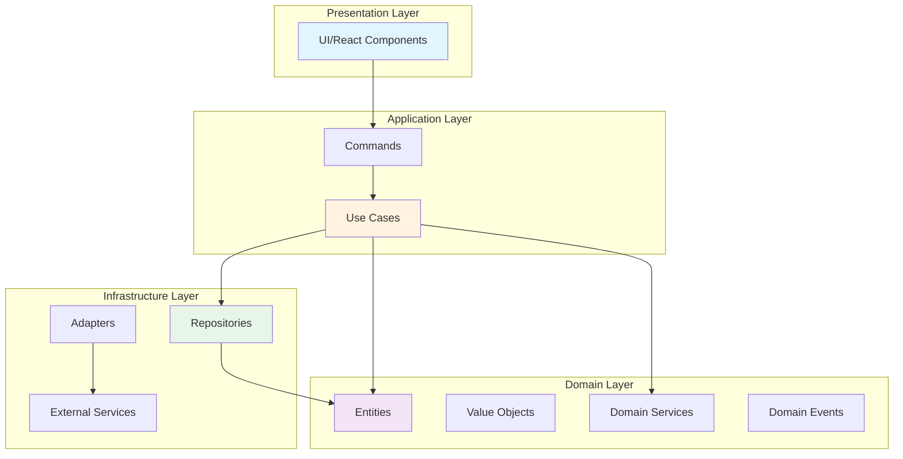

# 🚀 Pomotoro Contribution Guide

Welcome to the Pomotoro project! This guide will help you understand the codebase and start contributing effectively.

## 📚 Table of Contents

### 1. [Overview](./overview/)
- [Architecture Overview](./overview/architecture.md) - Understand our Clean Architecture approach
- [Getting Started](./overview/getting-started.md) - Set up your development environment
- [Development Workflow](./overview/workflow.md) - How we work together

### 2. [Layer Guides](./layers/)
Each layer has its own responsibilities and patterns:
- [Domain Layer](./layers/domain/) - Core business logic and entities
- [Use Cases Layer](./layers/usecases/) - Application business rules
- [Infrastructure Layer](./layers/infra/) - External adapters and services

### 3. [Connections & Flow](./connections/)
- [Data Flow](./connections/data-flow.md) - How data moves through layers
- [Event System](./connections/events.md) - Event-driven architecture
- [Dependencies](./connections/dependencies.md) - Layer dependencies and boundaries

### 4. [Workflows](./workflows/)
- [Adding a Feature](./workflows/adding-feature.md) - Step-by-step feature implementation
- [Fixing Bugs](./workflows/fixing-bugs.md) - Debug and fix issues
- [Testing](./workflows/testing.md) - Writing and running tests
- [Code Review](./workflows/code-review.md) - Review process and guidelines

## 🏗️ Architecture at a Glance

## 🎯 Quick Start

1. **Understand the Architecture**: Start with the [Architecture Overview](./overview/architecture.md)
2. **Set Up Environment**: Follow [Getting Started](./overview/getting-started.md)
3. **Pick a Layer**: Choose the layer you want to work on from [Layer Guides](./layers/)
4. **Follow a Workflow**: Use our [Workflows](./workflows/) for common tasks

## 🔑 Key Principles

- **Clean Architecture**: Strict separation of concerns
- **Domain-Driven Design**: Business logic at the core
- **Event-Driven**: Loose coupling through events
- **Test-Driven**: Tests first, implementation second
- **Type Safety**: Leverage Rust's type system

## 📝 Before You Contribute

1. Read the [style guide](../development/style-guide.md)
2. Understand the [naming conventions](../development/naming-convention.md)
3. Review existing [code templates](../development/code-templates.md)
4. Check the [project roadmap](../specs/)

Happy contributing! 🎉