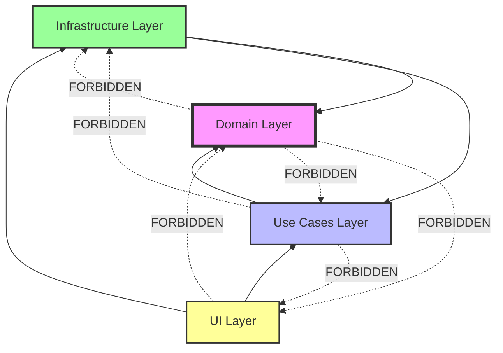
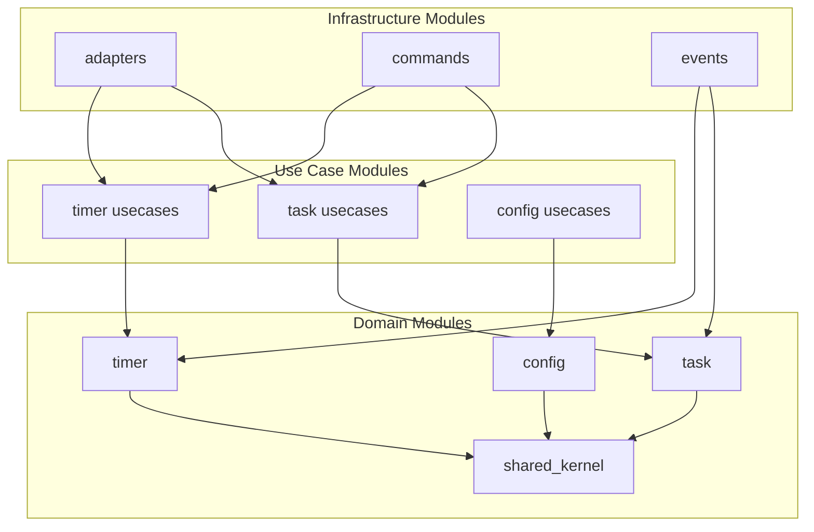

# 🔗 Dependencies & Layer Boundaries

Understanding dependencies between layers is crucial for maintaining clean architecture.

## Dependency Rules



## Layer Dependencies

### Domain Layer
**No external dependencies!**

```toml
# domain/Cargo.toml
[dependencies]
# Only standard library and pure Rust crates
serde = { version = "1.0", features = ["derive"] }
chrono = { version = "0.4", features = ["serde"] }
uuid = { version = "1.0", features = ["v4", "serde"] }
thiserror = "1.0"

# NO framework dependencies
# NO infrastructure dependencies
# NO external service dependencies
```

### Use Cases Layer
**Depends on Domain only**

```toml
# usecases/Cargo.toml
[dependencies]
# Domain dependency
domain = { path = "../domain" }

# Async runtime (abstraction only)
async-trait = "0.1"
tokio = { version = "1.0", features = ["sync"] }

# NO UI dependencies
# NO infrastructure implementations
```

### Infrastructure Layer
**Depends on Domain and Use Cases**

```toml
# infra/Cargo.toml
[dependencies]
# Internal dependencies
domain = { path = "../domain" }
usecases = { path = "../usecases" }

# Framework dependencies
tauri = { version = "2.0" }
tokio = { version = "1.0", features = ["full"] }

# External services
sqlx = { version = "0.7", optional = true }
reqwest = { version = "0.11", optional = true }
```

### UI Layer
**Depends on Use Cases (via Tauri commands)**

```json
// apps/react-ui/package.json
"dependencies": {
  "react": "^18",
  "react-dom": "^18",
  "@tauri-apps/api": "^2",
  "zustand": "^4"
}

# NO direct domain dependencies — talks to the backend via Tauri commands
```

## Dependency Injection

### Application Bootstrap
```rust
// infra/src/bootstrap.rs
pub struct Dependencies {
    // Repositories (Domain interfaces)
    pub task_repository: Arc<dyn TaskRepository>,
    pub timer_repository: Arc<dyn TimerRepository>,
    pub config_repository: Arc<dyn ConfigRepository>,
    
    // Services (Use case interfaces)
    pub notification_service: Arc<dyn NotificationService>,
    pub audio_service: Arc<dyn AudioService>,
    
    // Infrastructure
    pub event_bus: Arc<dyn EventBus>,
}

impl Dependencies {
    pub fn new(config: AppConfig) -> Result<Self> {
        // Create concrete implementations
        let task_repository = match config.storage {
            Storage::File => Arc::new(FileTaskRepository::new(config.data_dir.clone())),
            Storage::Memory => Arc::new(MemoryTaskRepository::new()),
            Storage::Database => Arc::new(SqliteTaskRepository::new(&config.db_url)?),
        };
        
        let notification_service = Arc::new(
            SystemNotificationAdapter::new()
        );
        
        let event_bus = Arc::new(
            MemoryEventBus::new()
        );
        
        Ok(Self {
            task_repository,
            notification_service,
            event_bus,
            // ...
        })
    }
}
```

### Use Case Creation
```rust
// infra/src/bootstrap.rs
pub fn create_use_cases(deps: &Dependencies) -> UseCases {
    UseCases {
        // Timer use cases
        start_timer: Arc::new(StartTimerSession::new(
            deps.timer_repository.clone(),
            deps.event_bus.clone(),
        )),
        pause_timer: Arc::new(PauseTimerSession::new(
            deps.timer_repository.clone(),
            deps.event_bus.clone(),
        )),
        
        // Task use cases
        create_task: Arc::new(CreateTask::new(
            deps.task_repository.clone(),
            deps.event_bus.clone(),
        )),
        complete_task: Arc::new(CompleteTask::new(
            deps.task_repository.clone(),
            deps.event_bus.clone(),
        )),
    }
}
```

## Interface Segregation

### Repository Interfaces
```rust
// domain/src/task/repository.rs
#[async_trait]
pub trait TaskRepository: Send + Sync {
    async fn save(&self, task: &Task) -> Result<()>;
    async fn find(&self, id: TaskId) -> Result<Option<Task>>;
    async fn list_active(&self) -> Result<Vec<Task>>;
    async fn delete(&self, id: TaskId) -> Result<()>;
}

// Separate read/write if needed
#[async_trait]
pub trait TaskReadRepository: Send + Sync {
    async fn find(&self, id: TaskId) -> Result<Option<Task>>;
    async fn list_active(&self) -> Result<Vec<Task>>;
}

#[async_trait]
pub trait TaskWriteRepository: Send + Sync {
    async fn save(&self, task: &Task) -> Result<()>;
    async fn delete(&self, id: TaskId) -> Result<()>;
}
```

### Service Interfaces
```rust
// usecases/src/notification/service.rs
#[async_trait]
pub trait NotificationService: Send + Sync {
    async fn send(&self, notification: &Notification) -> Result<()>;
}

// usecases/src/audio/service.rs
#[async_trait]
pub trait AudioService: Send + Sync {
    async fn play(&self, sound: Sound) -> Result<()>;
    async fn stop(&self) -> Result<()>;
}
```

## Boundary Objects

### DTOs at Use Case Boundary
```rust
// usecases/src/task/dto.rs
#[derive(Serialize, Deserialize)]
pub struct TaskDto {
    pub id: String,
    pub name: String,
    pub status: String,
    pub sessions_completed: u32,
}

// Conversion from domain
impl From<Task> for TaskDto {
    fn from(task: Task) -> Self {
        Self {
            id: task.id().to_string(),
            name: task.name().to_owned(),
            status: task.status().to_string(),
            sessions_completed: task.sessions_completed(),
        }
    }
}
```

### Command Arguments at Infrastructure Boundary
```rust
// infra/src/commands/task_cmd.rs
#[derive(Deserialize)]
pub struct CreateTaskArgs {
    pub name: String,
    pub estimated_sessions: u32,
    pub tags: Vec<String>,
}

#[tauri::command]
pub async fn create_task(
    state: State<'_, AppState>,
    args: CreateTaskArgs,
) -> Result<TaskDto, String> {
    // Convert to domain types
    let tags = args.tags.iter()
        .map(|t| Tag::from_str(t))
        .collect::<Result<Vec<_>, _>>()
        .map_err(|e| e.to_string())?;
    
    // Execute use case
    state.create_task_use_case()
        .execute(args.name, args.estimated_sessions, tags)
        .await
        .map_err(|e| e.to_string())
}
```

## Avoiding Circular Dependencies

### Problem Example
```rust
// ❌ BAD: Circular dependency
// domain/src/timer/timer.rs
use infra::notifications::NotificationService; // Domain depends on infra!

impl Timer {
    pub fn complete_phase(&mut self, notifier: &NotificationService) {
        notifier.send("Phase complete"); // Business logic coupled to infra
    }
}
```

### Solution: Dependency Inversion
```rust
// ✅ GOOD: Domain defines interface
// domain/src/timer/timer.rs
pub trait PhaseCompletionHandler: Send + Sync {
    fn handle_completion(&self, phase: &Phase);
}

impl Timer {
    pub fn complete_phase(&mut self) -> PhaseCompleted {
        // Return event instead
        PhaseCompleted {
            timer_id: self.id.clone(),
            completed_phase: self.current_phase.clone(),
        }
    }
}

// infra/src/adapters/timer/handlers.rs
impl PhaseCompletionHandler for NotificationAdapter {
    fn handle_completion(&self, phase: &Phase) {
        self.send_notification(&format!("{} complete", phase));
    }
}
```

## Testing with Dependencies

### Test Doubles
```rust
// domain/tests/helpers/mod.rs
pub struct InMemoryTaskRepository {
    tasks: Arc<RwLock<HashMap<TaskId, Task>>>,
}

#[async_trait]
impl TaskRepository for InMemoryTaskRepository {
    async fn save(&self, task: &Task) -> Result<()> {
        let mut tasks = self.tasks.write().await;
        tasks.insert(task.id().clone(), task.clone());
        Ok(())
    }
    
    async fn find(&self, id: TaskId) -> Result<Option<Task>> {
        let tasks = self.tasks.read().await;
        Ok(tasks.get(&id).cloned())
    }
}
```

### Mocking with Mockall
```rust
// usecases/tests/timer_tests.rs
use mockall::mock;

mock! {
    TimerRepo {}
    
    #[async_trait]
    impl TimerRepository for TimerRepo {
        async fn get_current(&self) -> Result<Timer>;
        async fn save(&self, timer: &Timer) -> Result<()>;
    }
}

#[tokio::test]
async fn start_timer_saves_state() {
    let mut mock = MockTimerRepo::new();
    mock.expect_get_current()
        .returning(|| Ok(Timer::new()));
    mock.expect_save()
        .times(1)
        .returning(|_| Ok(()));
    
    let use_case = StartTimerSession::new(
        Arc::new(mock),
        Arc::new(NoOpEventBus),
    );
    
    let result = use_case.execute(None).await;
    assert!(result.is_ok());
}
```

## Dependency Graph Visualization

### Generate Dependency Graph
```bash
# Using cargo-depgraph
cargo depgraph --all-deps | dot -Tpng > dependencies.png

# Using cargo-tree
cargo tree --workspace
```

### Module Dependencies


## Common Violations

### 1. Domain Importing Infrastructure
```rust
// ❌ WRONG
// domain/src/task/task.rs
use infra::database::DatabaseConnection; // Violation!
```

### 2. Use Cases Accessing UI
```rust
// ❌ WRONG
// usecases/src/timer/start_timer.rs
use ui::components::TimerDisplay; // Violation!
```

### 3. Skipping Layers
```rust
// ❌ WRONG
// ui/src/pages/timer.rs
use domain::timer::Timer; // UI shouldn't know domain directly!
```

## Best Practices

### Do's ✅
- Define interfaces in inner layers
- Implement interfaces in outer layers
- Use dependency injection
- Keep layer boundaries clear
- Test with test doubles
- Document dependencies

### Don'ts ❌
- Don't violate dependency rules
- Don't create circular dependencies
- Don't skip layers
- Don't leak implementation details
- Don't couple to frameworks
- Don't hardcode dependencies

## Next Steps
- Learn [Adding Features](../workflows/adding-feature.md)
- See [Testing Guide](../workflows/testing.md)
- Review [Architecture](../overview/architecture.md)