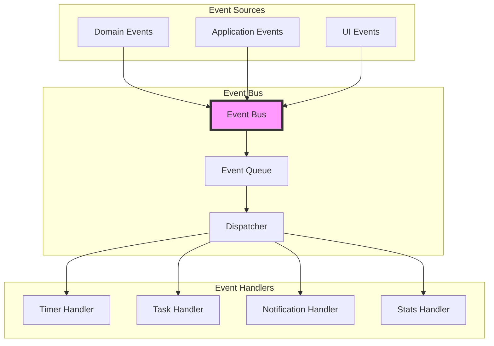
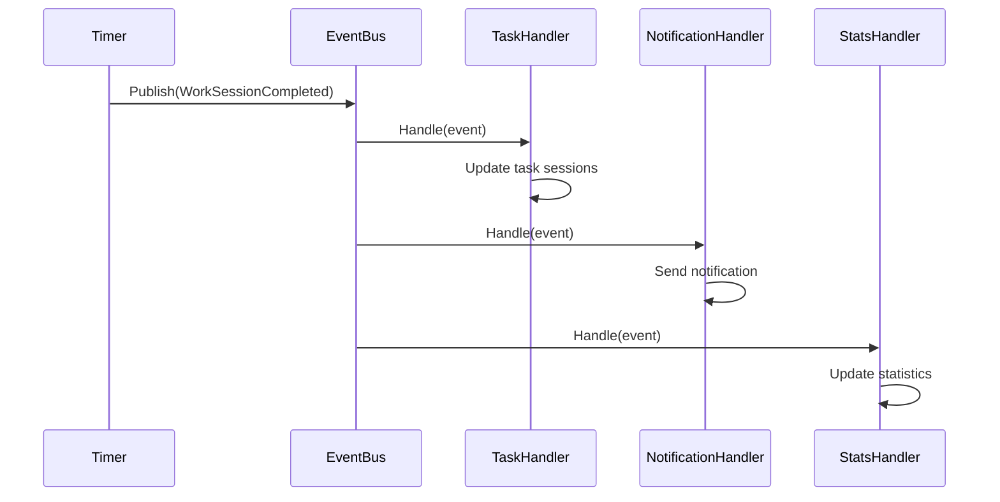

# 📡 Event System Architecture

The event system enables **loose coupling** between components through domain events and event-driven communication.

## Event Flow Overview



## Domain Events

### Event Definition
```rust
// domain/src/timer/events/timer_started.rs
use crate::shared_kernel::events::DomainEvent;

#[derive(Clone, Debug, Serialize, Deserialize)]
pub struct TimerStarted {
    pub timer_id: TimerId,
    pub task_id: Option<TaskId>,
    pub started_at: Timestamp,
    pub phase: Phase,
}

impl DomainEvent for TimerStarted {
    fn event_type(&self) -> &'static str {
        "timer.started"
    }
    
    fn aggregate_id(&self) -> String {
        self.timer_id.to_string()
    }
    
    fn occurred_at(&self) -> Timestamp {
        self.started_at.clone()
    }
}
```

### Event Categories

#### Timer Events
```rust
pub enum TimerEvents {
    Started(TimerStarted),
    Paused(TimerPaused),
    Resumed(TimerResumed),
    Tick(TimerTick),
    PhaseCompleted(PhaseCompleted),
    Reset(TimerReset),
}
```

#### Task Events
```rust
pub enum TaskEvents {
    Created(TaskCreated),
    Updated(TaskUpdated),
    Completed(TaskCompleted),
    SessionCompleted(TaskSessionCompleted),
    Cycled(TaskCycled),
}
```

## Event Bus Implementation

### Interface
```rust
// domain/src/shared_kernel/events/event_bus.rs
#[async_trait]
pub trait EventBus: Send + Sync {
    async fn publish<E: DomainEvent>(&self, event: E) -> Result<()>;
    async fn subscribe<E: DomainEvent>(&self, handler: Box<dyn EventHandler<E>>);
}
```

### Memory Implementation
```rust
// infra/src/events/mem_event_bus.rs
pub struct MemoryEventBus {
    handlers: Arc<RwLock<HashMap<TypeId, Vec<HandlerWrapper>>>>,
}

impl MemoryEventBus {
    pub fn new() -> Self {
        Self {
            handlers: Arc::new(RwLock::new(HashMap::new())),
        }
    }
}

#[async_trait]
impl EventBus for MemoryEventBus {
    async fn publish<E: DomainEvent>(&self, event: E) -> Result<()> {
        let type_id = TypeId::of::<E>();
        let handlers = self.handlers.read().await;
        
        if let Some(event_handlers) = handlers.get(&type_id) {
            for handler in event_handlers {
                handler.handle(Box::new(event.clone())).await?;
            }
        }
        
        Ok(())
    }
    
    async fn subscribe<E: DomainEvent>(&self, handler: Box<dyn EventHandler<E>>) {
        let type_id = TypeId::of::<E>();
        let mut handlers = self.handlers.write().await;
        
        handlers.entry(type_id)
            .or_insert_with(Vec::new)
            .push(HandlerWrapper::new(handler));
    }
}
```

## Event Handlers

### Handler Interface
```rust
#[async_trait]
pub trait EventHandler<E: DomainEvent>: Send + Sync {
    async fn handle(&self, event: E) -> Result<()>;
}
```

### Timer Tick Handler
```rust
// infra/src/adapters/timer/event_handlers/timer_tick.rs
pub struct TimerTickHandler {
    timer_repository: Arc<dyn TimerRepository>,
    event_bus: Arc<dyn EventBus>,
}

#[async_trait]
impl EventHandler<TimerTick> for TimerTickHandler {
    async fn handle(&self, event: TimerTick) -> Result<()> {
        // Load timer
        let mut timer = self.timer_repository
            .find(event.timer_id.clone())
            .await?
            .ok_or(Error::TimerNotFound)?;
        
        // Update timer
        timer.add_elapsed(Duration::from_secs(1));
        
        // Check for phase completion
        if timer.is_phase_complete() {
            let phase_completed = timer.complete_phase()?;
            self.event_bus.publish(phase_completed).await?;
        }
        
        // Save updated timer
        self.timer_repository.save(&timer).await?;
        
        Ok(())
    }
}
```

### Notification Handler
```rust
pub struct NotificationHandler {
    notification_service: Arc<dyn NotificationService>,
}

#[async_trait]
impl EventHandler<PhaseCompleted> for NotificationHandler {
    async fn handle(&self, event: PhaseCompleted) -> Result<()> {
        let message = match event.completed_phase {
            Phase::Work => "Work session completed! Time for a break.",
            Phase::ShortBreak => "Break is over! Ready to work?",
            Phase::LongBreak => "Long break completed! Let's get back to it.",
        };
        
        self.notification_service
            .send(Notification::new(
                "Pomodoro Timer".to_string(),
                message.to_string(),
                NotificationLevel::Info,
            ))
            .await?;
        
        Ok(())
    }
}
```

### Statistics Handler
```rust
pub struct StatsHandler {
    stats_repository: Arc<dyn StatsRepository>,
}

#[async_trait]
impl EventHandler<TaskSessionCompleted> for StatsHandler {
    async fn handle(&self, event: TaskSessionCompleted) -> Result<()> {
        let mut stats = self.stats_repository
            .get_or_create_today()
            .await?;
        
        stats.increment_sessions();
        stats.add_task_session(event.task_id.clone());
        
        self.stats_repository.save(&stats).await?;
        
        Ok(())
    }
}
```

## Event Registration

### Bootstrap Process
```rust
// infra/src/bootstrap.rs
pub async fn register_event_handlers(
    event_bus: Arc<dyn EventBus>,
    repositories: &Repositories,
    services: &Services,
) {
    // Timer events
    event_bus.subscribe::<TimerTick>(Box::new(
        TimerTickHandler::new(repositories.timer.clone())
    )).await;
    
    event_bus.subscribe::<TimerStarted>(Box::new(
        TimerStartedHandler::new(services.audio.clone())
    )).await;
    
    // Task events
    event_bus.subscribe::<TaskCompleted>(Box::new(
        TaskCompletedHandler::new(
            repositories.task.clone(),
            services.notification.clone(),
        )
    )).await;
    
    // Phase events
    event_bus.subscribe::<PhaseCompleted>(Box::new(
        PhaseCompletedHandler::new(
            services.notification.clone(),
            services.audio.clone(),
        )
    )).await;
}
```

## Event Patterns

### Event Sourcing
```rust
pub struct EventStore {
    events: Vec<Box<dyn DomainEvent>>,
}

impl EventStore {
    pub async fn append(&mut self, event: Box<dyn DomainEvent>) {
        self.events.push(event);
    }
    
    pub async fn replay(&self) -> Result<Timer> {
        let mut timer = Timer::new();
        
        for event in &self.events {
            timer.apply_event(event)?;
        }
        
        Ok(timer)
    }
}
```

### Saga Pattern
```rust
pub struct PomodoroSaga {
    timer_service: Arc<TimerService>,
    task_service: Arc<TaskService>,
    notification_service: Arc<NotificationService>,
}

impl PomodoroSaga {
    pub async fn handle_work_completed(&self, event: WorkSessionCompleted) -> Result<()> {
        // Step 1: Update task
        self.task_service
            .increment_session(event.task_id.clone())
            .await?;
        
        // Step 2: Start break
        let break_duration = self.calculate_break_duration(&event).await?;
        self.timer_service
            .start_break(break_duration)
            .await?;
        
        // Step 3: Send notification
        self.notification_service
            .notify("Work complete! Starting break...")
            .await?;
        
        Ok(())
    }
}
```

### Event Choreography


## UI Event Integration

### Tauri Events
```rust
// Emit events to frontend
pub async fn emit_timer_update(
    app_handle: &AppHandle,
    timer_state: TimerStateDto,
) -> Result<()> {
    app_handle.emit_all("timer-update", timer_state)?;
    Ok(())
}

// Listen in frontend
import { listen } from '@tauri-apps/api/event';

await listen('timer-update', (event) => {
    updateTimerDisplay(event.payload);
});
```

### WebSocket Events (Alternative)
```rust
pub struct WebSocketEventBroadcaster {
    connections: Arc<RwLock<Vec<WebSocketConnection>>>,
}

impl WebSocketEventBroadcaster {
    pub async fn broadcast<E: DomainEvent>(&self, event: E) {
        let message = serde_json::to_string(&event).unwrap();
        let connections = self.connections.read().await;
        
        for conn in connections.iter() {
            let _ = conn.send(message.clone()).await;
        }
    }
}
```

## Event Testing

### Unit Testing
```rust
#[tokio::test]
async fn timer_tick_updates_elapsed_time() {
    let mock_repo = Arc::new(MockTimerRepository::new());
    let mock_bus = Arc::new(MockEventBus::new());
    
    let handler = TimerTickHandler::new(mock_repo.clone(), mock_bus.clone());
    
    let event = TimerTick {
        timer_id: TimerId::new(),
        current_time: Timestamp::now(),
    };
    
    handler.handle(event).await.unwrap();
    
    assert_eq!(mock_repo.save_called(), 1);
}
```

### Integration Testing
```rust
#[tokio::test]
async fn complete_pomodoro_flow() {
    let context = TestContext::new().await;
    
    // Start timer
    context.publish(TimerStarted { ... }).await;
    
    // Simulate ticks
    for _ in 0..1500 { // 25 minutes
        context.publish(TimerTick { ... }).await;
    }
    
    // Verify phase completed event
    let events = context.get_published_events().await;
    assert!(events.iter().any(|e| e.is::<PhaseCompleted>()));
}
```

## Performance Considerations

### Async Processing
```rust
impl EventBus for AsyncEventBus {
    async fn publish<E: DomainEvent>(&self, event: E) -> Result<()> {
        // Don't wait for handlers
        let handlers = self.get_handlers::<E>().await;
        
        for handler in handlers {
            tokio::spawn(async move {
                if let Err(e) = handler.handle(event.clone()).await {
                    log::error!("Handler error: {}", e);
                }
            });
        }
        
        Ok(())
    }
}
```

### Event Batching
```rust
pub struct BatchedEventBus {
    buffer: Arc<Mutex<Vec<Box<dyn DomainEvent>>>>,
    flush_interval: Duration,
}

impl BatchedEventBus {
    pub async fn start_flushing(&self) {
        loop {
            sleep(self.flush_interval).await;
            self.flush().await;
        }
    }
    
    async fn flush(&self) {
        let events = {
            let mut buffer = self.buffer.lock().unwrap();
            std::mem::take(&mut *buffer)
        };
        
        for event in events {
            self.process_event(event).await;
        }
    }
}
```

## Best Practices

### Do's ✅
- Keep events immutable
- Use past tense for event names
- Include all necessary data in events
- Make handlers idempotent
- Log event processing
- Handle errors gracefully

### Don'ts ❌
- Don't put business logic in handlers
- Don't create circular dependencies
- Don't block event processing
- Don't modify events after publishing
- Don't ignore failed handlers
- Don't couple handlers tightly

## Next Steps
- Understand [Dependencies](./dependencies.md)
- Learn [Adding Features](../workflows/adding-feature.md)
- See [Testing Guide](../workflows/testing.md)