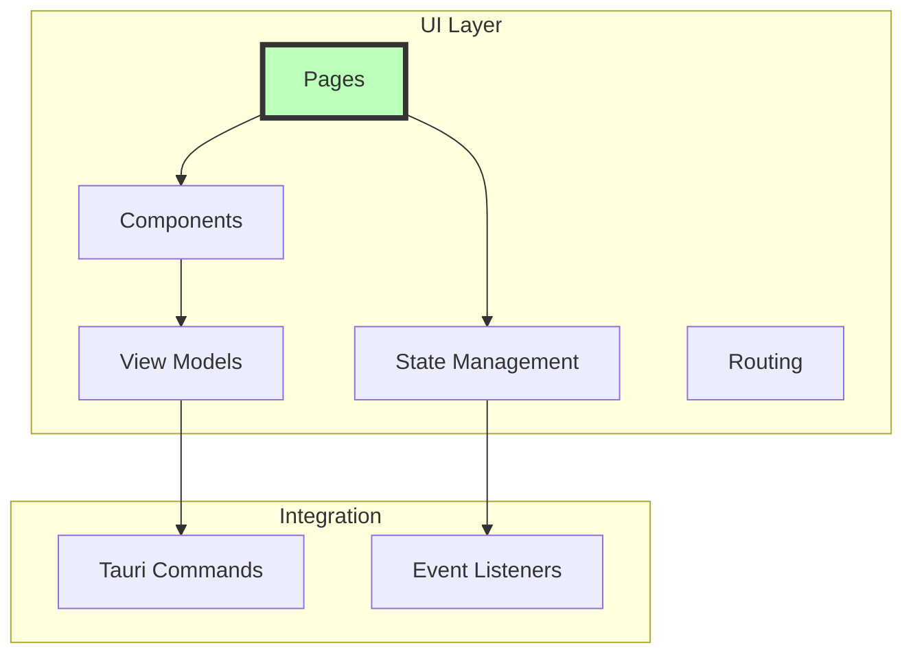

# 🎨 UI Layer Guide

The UI layer provides the **user interface** using Leptos (Rust's reactive web framework) compiled to WASM.

## Architecture Overview



## Core Concepts

### 1. Leptos Components
Reactive components with signals:
```rust
#[component]
pub fn TimerDisplay() -> impl IntoView {
    let timer_state = use_timer_state();
    
    view! {
        <div class="timer-display">
            <h1>{move || timer_state.time_remaining()}</h1>
            <p class="phase">{move || timer_state.current_phase()}</p>
        </div>
    }
}
```

### 2. Pages
Top-level route components:
```rust
#[component]
pub fn TimerPage() -> impl IntoView {
    provide_context(TimerState::new());
    
    view! {
        <div class="timer-page">
            <PageHeader title="Timer" />
            <TimerDisplay />
            <TimerControls />
        </div>
    }
}
```

### 3. State Management
Reactive state with signals:
```rust
#[derive(Clone)]
pub struct TimerState {
    timer: RwSignal<Timer>,
    is_running: RwSignal<bool>,
}

impl TimerState {
    pub fn new() -> Self {
        Self {
            timer: create_rw_signal(Timer::default()),
            is_running: create_rw_signal(false),
        }
    }
    
    pub fn start(&self) {
        self.is_running.set(true);
        spawn_local(async move {
            let _ = invoke("start_timer", {}).await;
        });
    }
}
```

### 4. View Models
Bridge between UI and business logic:
```rust
pub struct TimerViewModel {
    state: TimerState,
    commands: TimerCommands,
}

impl TimerViewModel {
    pub fn time_display(&self) -> String {
        let minutes = self.state.minutes.get();
        let seconds = self.state.seconds.get();
        format!("{:02}:{:02}", minutes, seconds)
    }
    
    pub async fn start_timer(&self) -> Result<()> {
        self.commands.start().await?;
        self.state.is_running.set(true);
        Ok(())
    }
}
```

## File Structure
```
ui/src/
├── components/           # Reusable components
│   ├── mod.rs
│   ├── circular_progress.rs
│   ├── navigation.rs
│   ├── sidebar.rs
│   └── screen_blocker.rs
├── pages/               # Route pages
│   ├── mod.rs
│   ├── timer/
│   │   ├── mod.rs
│   │   ├── timer_page.rs
│   │   ├── timer_display.rs
│   │   ├── timer_controls.rs
│   │   └── timer_state.rs
│   ├── task/
│   │   ├── mod.rs
│   │   ├── task_page.rs
│   │   ├── task_list.rs
│   │   ├── task_form.rs
│   │   └── task_state.rs
│   └── settings/
│       ├── mod.rs
│       ├── settings_page.rs
│       └── settings_state.rs
├── store/               # Global state
│   ├── mod.rs
│   └── events.rs
├── app.rs              # Main app component
└── lib.rs              # Entry point
```

## Creating UI Components

### Basic Component
```rust
// ui/src/components/button.rs
use leptos::*;

#[component]
pub fn Button(
    #[prop(into)] text: String,
    #[prop(into)] on_click: Callback<MouseEvent>,
    #[prop(default = false)] disabled: bool,
) -> impl IntoView {
    view! {
        <button
            class="btn"
            class:disabled=disabled
            on:click=on_click
            disabled=disabled
        >
            {text}
        </button>
    }
}
```

### Component with State
```rust
// ui/src/components/counter.rs
#[component]
pub fn Counter() -> impl IntoView {
    let (count, set_count) = create_signal(0);
    
    let increment = move |_| set_count.update(|n| *n += 1);
    let decrement = move |_| set_count.update(|n| *n -= 1);
    
    view! {
        <div class="counter">
            <button on:click=decrement>"-"</button>
            <span>{count}</span>
            <button on:click=increment>"+"</button>
        </div>
    }
}
```

### Component with Effects
```rust
#[component]
pub fn AutoSave(
    #[prop(into)] content: Signal<String>,
) -> impl IntoView {
    let save_status = create_rw_signal("Saved");
    
    create_effect(move |_| {
        let content = content.get();
        save_status.set("Saving...");
        
        spawn_local(async move {
            let _ = invoke("save_content", content).await;
            save_status.set("Saved");
        });
    });
    
    view! {
        <div class="save-status">{save_status}</div>
    }
}
```

## Page Components

### Creating a Page
```rust
// ui/src/pages/notification/notification_page.rs
use leptos::*;
use leptos_router::*;

#[component]
pub fn NotificationPage() -> impl IntoView {
    // Provide page state
    provide_context(NotificationState::new());
    
    // Get state
    let state = use_context::<NotificationState>()
        .expect("NotificationState must be provided");
    
    // Load initial data
    create_resource(
        || (),
        |_| async move {
            invoke("get_notifications", {}).await
        }
    );
    
    view! {
        <div class="notification-page">
            <PageHeader title="Notifications" />
            <NotificationList />
            <NotificationActions />
        </div>
    }
}
```

### Page State Management
```rust
// ui/src/pages/notification/notification_state.rs
#[derive(Clone)]
pub struct NotificationState {
    notifications: RwSignal<Vec<Notification>>,
    selected: RwSignal<Option<NotificationId>>,
    filter: RwSignal<NotificationFilter>,
}

impl NotificationState {
    pub fn new() -> Self {
        Self {
            notifications: create_rw_signal(Vec::new()),
            selected: create_rw_signal(None),
            filter: create_rw_signal(NotificationFilter::All),
        }
    }
    
    pub fn filtered_notifications(&self) -> Vec<Notification> {
        let all = self.notifications.get();
        let filter = self.filter.get();
        
        all.into_iter()
            .filter(|n| filter.matches(n))
            .collect()
    }
    
    pub async fn mark_as_read(&self, id: NotificationId) {
        let _ = invoke("mark_notification_read", id).await;
        self.refresh().await;
    }
}
```

## Tauri Integration

### Invoking Commands
```rust
use tauri_sys::tauri::invoke;
use serde::{Serialize, Deserialize};

#[derive(Serialize)]
struct StartTimerArgs {
    task_id: Option<String>,
}

async fn start_timer(task_id: Option<String>) -> Result<TimerState, String> {
    invoke("start_timer", &StartTimerArgs { task_id }).await
}
```

### Listening to Events
```rust
use tauri_sys::event::{listen, Event};

#[component]
pub fn EventListener() -> impl IntoView {
    let notifications = create_rw_signal(Vec::new());
    
    create_effect(move |_| {
        spawn_local(async move {
            let unlisten = listen::<NotificationEvent>("notification", move |event| {
                notifications.update(|n| n.push(event.payload));
            }).await;
            
            // Store unlisten handle for cleanup
            on_cleanup(move || {
                unlisten();
            });
        });
    });
    
    view! {
        <div>{move || notifications.get().len()} " notifications"</div>
    }
}
```

## Styling

### Component Styles
```css
/* styles.css */
.timer-display {
    display: flex;
    flex-direction: column;
    align-items: center;
    padding: 2rem;
}

.timer-display h1 {
    font-size: 4rem;
    font-weight: bold;
    margin: 0;
}

.timer-display .phase {
    font-size: 1.2rem;
    color: var(--text-secondary);
}
```

### Dynamic Styling
```rust
#[component]
pub fn ProgressBar(
    #[prop(into)] progress: Signal<f32>,
) -> impl IntoView {
    let width = move || format!("{}%", progress.get() * 100.0);
    
    view! {
        <div class="progress-bar">
            <div 
                class="progress-fill"
                style:width=width
            />
        </div>
    }
}
```

### Theme Support
```rust
#[component]
pub fn ThemedButton() -> impl IntoView {
    let theme = use_context::<Theme>().unwrap();
    
    let button_class = move || {
        match theme.current.get() {
            Theme::Light => "btn-light",
            Theme::Dark => "btn-dark",
        }
    };
    
    view! {
        <button class=button_class>
            "Click me"
        </button>
    }
}
```

## Testing UI Components

### Component Tests
```rust
#[cfg(test)]
mod tests {
    use super::*;
    use leptos::*;

    #[test]
    fn button_renders_text() {
        let text = "Test Button";
        let view = view! {
            <Button text=text on_click=|_| {} />
        };
        
        // Assert component renders correctly
        assert!(view.to_string().contains(text));
    }
}
```

### Integration Tests
```rust
#[wasm_bindgen_test]
async fn timer_starts_on_click() {
    let doc = document();
    let body = doc.body().unwrap();
    
    mount_to_body(|| view! { <TimerPage /> });
    
    let start_button = doc.query_selector(".start-button").unwrap();
    start_button.click();
    
    // Wait for async operation
    sleep(Duration::from_millis(100)).await;
    
    let status = doc.query_selector(".timer-status").unwrap();
    assert_eq!(status.text_content(), Some("Running".into()));
}
```

## Performance Optimization

### Memoization
```rust
#[component]
pub fn ExpensiveComponent(
    #[prop(into)] data: Signal<Vec<Item>>,
) -> impl IntoView {
    let processed = create_memo(move |_| {
        // Expensive computation
        data.get().iter()
            .map(|item| expensive_process(item))
            .collect::<Vec<_>>()
    });
    
    view! {
        <div>
            {move || processed.get().into_view()}
        </div>
    }
}
```

### Lazy Loading
```rust
#[component]
pub fn LazyImage(
    #[prop(into)] src: String,
) -> impl IntoView {
    let (loaded, set_loaded) = create_signal(false);
    
    view! {
        <Suspense fallback=move || view! { <div>"Loading..."</div> }>
            {move || {
                if loaded.get() {
                    view! {  }
                } else {
                    spawn_local(async move {
                        // Simulate loading
                        sleep(Duration::from_millis(500)).await;
                        set_loaded.set(true);
                    });
                    view! { <div>"Loading image..."</div> }
                }
            }}
        </Suspense>
    }
}
```

## Best Practices

### Do's ✅
- Keep components small and focused
- Use proper prop types
- Leverage Leptos reactivity
- Handle loading and error states
- Use semantic HTML
- Test component behavior

### Don'ts ❌
- Don't put business logic in components
- Don't manipulate DOM directly
- Don't ignore accessibility
- Don't skip error boundaries
- Don't create memory leaks
- Don't block the main thread

## Debugging Tips

### Console Logging
```rust
use web_sys::console;

#[component]
pub fn DebugComponent() -> impl IntoView {
    let (count, set_count) = create_signal(0);
    
    create_effect(move |_| {
        console::log_1(&format!("Count changed: {}", count.get()).into());
    });
    
    view! {
        <button on:click=move |_| set_count.update(|n| *n += 1)>
            "Increment"
        </button>
    }
}
```

### DevTools Integration
```rust
#[cfg(debug_assertions)]
fn enable_dev_tools() {
    use leptos::*;
    console_error_panic_hook::set_once();
    leptos::logging::log!("Dev tools enabled");
}
```

## Next Steps
- Learn about [Data Flow](../../connections/data-flow.md)
- Explore [Event System](../../connections/events.md)
- See [Adding Features](../../workflows/adding-feature.md)