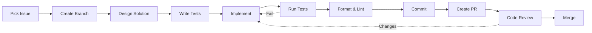
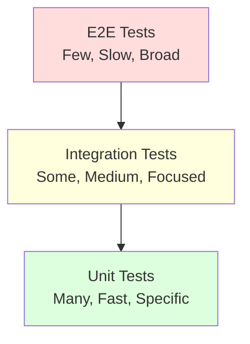
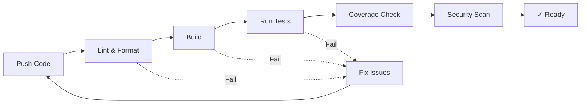

# 🔄 Development Workflow

## Git Workflow

### Branch Naming Convention
```
feature/description   # New features
fix/issue-number     # Bug fixes  
refactor/module      # Code refactoring
docs/topic          # Documentation
test/module         # Test additions
```

### Commit Message Format
```
type(scope): subject

body (optional)

footer (optional)
```

**Types:**
- `feat`: New feature
- `fix`: Bug fix
- `refactor`: Code refactoring
- `test`: Test additions/changes
- `docs`: Documentation
- `style`: Formatting changes
- `perf`: Performance improvements
- `chore`: Maintenance tasks

**Examples:**
```bash
git commit -m "feat(timer): add pause functionality"
git commit -m "fix(task): resolve cycling issue #42"
git commit -m "refactor(domain): extract timer state machine"
```

## Development Cycle



## Code Quality Checklist

### Before Committing
- [ ] Tests pass: `cargo test`
- [ ] Code formatted: `cargo fmt`
- [ ] No clippy warnings: `cargo clippy`
- [ ] Documentation updated
- [ ] Examples work (if applicable)

### Before PR
- [ ] Branch up-to-date with main
- [ ] Commit messages follow convention
- [ ] PR description complete
- [ ] CI/CD passes
- [ ] Self-review completed

## Working with Different Layers

### Domain Layer Changes
1. **Design First**: Document your domain model changes
2. **Test Domain Logic**: Write unit tests
3. **Update Aggregates**: Modify entities/value objects
4. **Emit Events**: Add necessary domain events

### Use Case Changes
1. **Define Interface**: Start with use case interface
2. **Write Integration Test**: Test the complete flow
3. **Implement Logic**: Write the use case
4. **Handle Errors**: Proper error handling

### Infrastructure Changes
1. **Check Interfaces**: Ensure domain interfaces are satisfied
2. **Test with Real Services**: Integration tests
3. **Handle External Failures**: Resilience patterns
4. **Document Configuration**: Update configs

### UI Changes
1. **Design Component**: Sketch UI/UX
2. **Create View Model**: State management
3. **Build Component**: Leptos component
4. **Test Interactions**: Component tests

## Testing Philosophy

### Test Pyramid


### Writing Tests

#### Unit Test Example
```rust
#[cfg(test)]
mod tests {
    use super::*;

    #[test]
    fn timer_should_start_in_idle_state() {
        let timer = Timer::new(test_config());
        assert_eq!(timer.state(), TimerState::Idle);
    }
}
```

#### Integration Test Example
```rust
#[tokio::test]
async fn complete_pomodoro_session() {
    let context = TestContext::new().await;
    
    context.start_timer().await;
    context.advance_time(25.minutes()).await;
    
    assert_eq!(context.timer_state(), TimerState::Break);
}
```

## Code Review Process

### As Author
1. **Self-Review First**: Review your own changes
2. **Provide Context**: Explain decisions in PR description
3. **Link Issues**: Reference related issues
4. **Update Promptly**: Address feedback quickly

### As Reviewer
1. **Understand Context**: Read PR description and linked issues
2. **Check Tests**: Ensure adequate test coverage
3. **Review Architecture**: Verify layer boundaries
4. **Suggest Improvements**: Be constructive
5. **Approve/Request Changes**: Clear feedback

### Review Checklist
- [ ] Code follows project style
- [ ] Tests are comprehensive
- [ ] Documentation updated
- [ ] No security issues
- [ ] Performance considered
- [ ] Error handling appropriate

## Continuous Integration

### CI Pipeline


### Local CI Simulation
```bash
# Run what CI runs
./scripts/ci-local.sh

# Or manually:
cargo fmt --check
cargo clippy -- -D warnings
cargo test --workspace
cargo tarpaulin --min 80
```

## Release Process

### Version Bumping
Follow semantic versioning:
- **Major**: Breaking changes
- **Minor**: New features (backward compatible)
- **Patch**: Bug fixes

### Release Checklist
1. [ ] Update version in `Cargo.toml`
2. [ ] Update CHANGELOG.md
3. [ ] Run full test suite
4. [ ] Build release binaries
5. [ ] Tag release
6. [ ] Create GitHub release
7. [ ] Update documentation

## Best Practices

### Do's ✅
- Write tests first (TDD)
- Keep commits atomic
- Document public APIs
- Use meaningful variable names
- Handle errors explicitly
- Follow SOLID principles

### Don'ts ❌
- Don't commit broken code
- Don't skip tests
- Don't ignore clippy warnings
- Don't violate layer boundaries
- Don't commit secrets
- Don't force push to main

## Getting Unstuck

### When You're Blocked
1. **Check Documentation**: Read relevant docs
2. **Search Codebase**: Look for similar patterns
3. **Run Tests**: Understand expected behavior
4. **Ask Questions**: Create discussion/issue
5. **Pair Program**: Work with another contributor

### Resources
- [Architecture Overview](./architecture.md)
- [Layer Guides](../layers/)
- [Code Templates](../../development/code-templates.md)
- [Style Guide](../../development/style-guide.md)

## Next Steps
- Set up your [development environment](./getting-started.md)
- Understand the [architecture](./architecture.md)
- Pick a [workflow](../workflows/) for your task