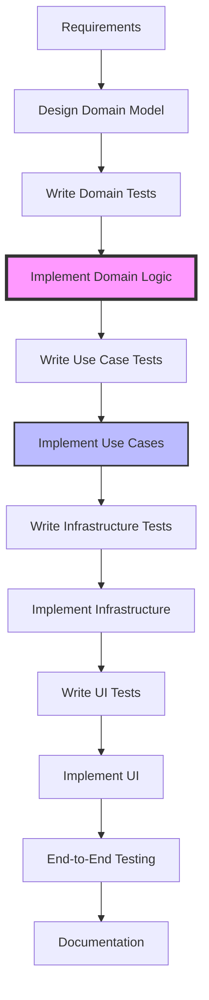

# 🚀 Adding a New Feature

A step-by-step guide to implementing new features following Clean Architecture.

## Feature Implementation Flow



## Example: Adding a "Notes" Feature

Let's walk through adding a notes feature to tasks.

### Step 1: Design Domain Model

#### Define Requirements
- Users can add notes to tasks
- Notes have content and timestamp
- Notes can be edited or deleted
- Notes are displayed chronologically

#### Design Entities
```rust
// domain/src/task/note.rs
use crate::shared_kernel::value_objects::{Timestamp, NoteId};

#[derive(Clone, Debug, PartialEq)]
pub struct Note {
    id: NoteId,
    content: String,
    created_at: Timestamp,
    updated_at: Option<Timestamp>,
}

impl Note {
    pub fn new(content: String) -> Result<Self, DomainError> {
        if content.is_empty() {
            return Err(DomainError::EmptyNote);
        }
        
        Ok(Self {
            id: NoteId::new(),
            content,
            created_at: Timestamp::now(),
            updated_at: None,
        })
    }
    
    pub fn update_content(&mut self, content: String) -> Result<(), DomainError> {
        if content.is_empty() {
            return Err(DomainError::EmptyNote);
        }
        
        self.content = content;
        self.updated_at = Some(Timestamp::now());
        Ok(())
    }
}
```

#### Update Task Entity
```rust
// domain/src/task/task.rs
pub struct Task {
    // ... existing fields
    notes: Vec<Note>,
}

impl Task {
    pub fn add_note(&mut self, content: String) -> Result<NoteAdded, DomainError> {
        let note = Note::new(content)?;
        let note_id = note.id().clone();
        
        self.notes.push(note);
        
        Ok(NoteAdded {
            task_id: self.id.clone(),
            note_id,
            added_at: Timestamp::now(),
        })
    }
    
    pub fn update_note(&mut self, note_id: NoteId, content: String) -> Result<(), DomainError> {
        let note = self.notes.iter_mut()
            .find(|n| n.id() == &note_id)
            .ok_or(DomainError::NoteNotFound)?;
        
        note.update_content(content)?;
        Ok(())
    }
    
    pub fn remove_note(&mut self, note_id: NoteId) -> Result<(), DomainError> {
        let index = self.notes.iter()
            .position(|n| n.id() == &note_id)
            .ok_or(DomainError::NoteNotFound)?;
        
        self.notes.remove(index);
        Ok(())
    }
}
```

### Step 2: Write Domain Tests

```rust
// domain/src/task/tests/note_tests.rs
#[cfg(test)]
mod tests {
    use super::*;

    #[test]
    fn task_can_add_note() {
        let mut task = Task::new("Test Task".to_string());
        
        let result = task.add_note("First note".to_string());
        
        assert!(result.is_ok());
        assert_eq!(task.notes().len(), 1);
        assert_eq!(task.notes()[0].content(), "First note");
    }
    
    #[test]
    fn empty_note_returns_error() {
        let mut task = Task::new("Test Task".to_string());
        
        let result = task.add_note("".to_string());
        
        assert!(matches!(result, Err(DomainError::EmptyNote)));
    }
    
    #[test]
    fn note_can_be_updated() {
        let mut task = Task::new("Test Task".to_string());
        let event = task.add_note("Original".to_string()).unwrap();
        
        let result = task.update_note(event.note_id, "Updated".to_string());
        
        assert!(result.is_ok());
        assert_eq!(task.notes()[0].content(), "Updated");
        assert!(task.notes()[0].updated_at().is_some());
    }
}
```

### Step 3: Create Use Cases

#### Add Note Use Case
```rust
// usecases/src/task/add_note.rs
pub struct AddNoteToTask {
    task_repository: Arc<dyn TaskRepository>,
    event_bus: Arc<dyn EventBus>,
}

impl AddNoteToTask {
    pub async fn execute(
        &self,
        task_id: TaskId,
        content: String,
    ) -> Result<NoteDto, UseCaseError> {
        // Load task
        let mut task = self.task_repository
            .find(task_id.clone())
            .await?
            .ok_or(UseCaseError::TaskNotFound)?;
        
        // Add note (domain logic)
        let event = task.add_note(content)?;
        
        // Save task
        self.task_repository.save(&task).await?;
        
        // Publish event
        self.event_bus.publish(event.clone()).await;
        
        // Return DTO
        let note = task.notes()
            .iter()
            .find(|n| n.id() == &event.note_id)
            .unwrap();
        
        Ok(NoteDto::from(note))
    }
}
```

#### DTOs
```rust
// usecases/src/task/dto/note_dto.rs
#[derive(Serialize, Deserialize)]
pub struct NoteDto {
    pub id: String,
    pub content: String,
    pub created_at: String,
    pub updated_at: Option<String>,
}

impl From<&Note> for NoteDto {
    fn from(note: &Note) -> Self {
        Self {
            id: note.id().to_string(),
            content: note.content().to_string(),
            created_at: note.created_at().to_rfc3339(),
            updated_at: note.updated_at().map(|t| t.to_rfc3339()),
        }
    }
}
```

### Step 4: Infrastructure Implementation

#### Update Repository
```rust
// infra/src/adapters/task/file_repo.rs
impl TaskRepository for FileTaskRepository {
    async fn save(&self, task: &Task) -> Result<()> {
        let path = self.task_path(task.id());
        
        // Include notes in serialization
        let dto = TaskWithNotesDto::from(task);
        let json = serde_json::to_string_pretty(&dto)?;
        
        tokio::fs::write(path, json).await?;
        Ok(())
    }
}
```

#### Add Tauri Commands
```rust
// infra/src/commands/task_cmd.rs
#[tauri::command]
pub async fn add_note_to_task(
    state: State<'_, AppState>,
    task_id: String,
    content: String,
) -> Result<NoteDto, String> {
    let task_id = TaskId::from_str(&task_id)
        .map_err(|e| e.to_string())?;
    
    state.add_note_use_case()
        .execute(task_id, content)
        .await
        .map_err(|e| e.to_string())
}

#[tauri::command]
pub async fn update_task_note(
    state: State<'_, AppState>,
    task_id: String,
    note_id: String,
    content: String,
) -> Result<(), String> {
    // Implementation
}

#[tauri::command]
pub async fn delete_task_note(
    state: State<'_, AppState>,
    task_id: String,
    note_id: String,
) -> Result<(), String> {
    // Implementation
}
```

### Step 5: UI Implementation

#### Note Component
```rust
// ui/src/components/note.rs
#[component]
pub fn NoteItem(
    note: NoteDto,
    on_edit: Callback<String>,
    on_delete: Callback<()>,
) -> impl IntoView {
    let (editing, set_editing) = create_signal(false);
    let (content, set_content) = create_signal(note.content.clone());
    
    view! {
        <div class="note-item">
            {move || if editing.get() {
                view! {
                    <textarea
                        value=content
                        on:input=move |e| set_content.set(event_target_value(&e))
                    />
                    <button on:click=move |_| {
                        on_edit.call(content.get());
                        set_editing.set(false);
                    }>
                        "Save"
                    </button>
                }
            } else {
                view! {
                    <p>{&note.content}</p>
                    <span class="timestamp">{&note.created_at}</span>
                    <button on:click=move |_| set_editing.set(true)>
                        "Edit"
                    </button>
                    <button on:click=move |_| on_delete.call(())>
                        "Delete"
                    </button>
                }
            }}
        </div>
    }
}
```

#### Notes List
```rust
// ui/src/components/notes_list.rs
#[component]
pub fn NotesList(task_id: String) -> impl IntoView {
    let notes = create_resource(
        move || task_id.clone(),
        |id| async move {
            invoke("get_task_notes", GetTaskNotesArgs { task_id: id }).await
        }
    );
    
    let add_note = move |content: String| {
        spawn_local(async move {
            let _ = invoke("add_note_to_task", AddNoteArgs {
                task_id: task_id.clone(),
                content,
            }).await;
            notes.refetch();
        });
    };
    
    view! {
        <div class="notes-list">
            <h3>"Notes"</h3>
            <NoteInput on_submit=add_note />
            <Suspense fallback=move || view! { <p>"Loading notes..."</p> }>
                {move || notes.get().map(|notes| {
                    notes.into_iter().map(|note| {
                        view! { <NoteItem note=note /> }
                    }).collect_view()
                })}
            </Suspense>
        </div>
    }
}
```

### Step 6: End-to-End Testing

```rust
// tests/e2e/notes_feature.rs
#[tokio::test]
async fn complete_notes_workflow() {
    let context = TestContext::new().await;
    
    // Create task
    let task_id = context.create_task("Test Task").await;
    
    // Add note
    let note = context.add_note_to_task(
        task_id.clone(),
        "First note"
    ).await;
    
    assert_eq!(note.content, "First note");
    
    // Update note
    context.update_note(
        task_id.clone(),
        note.id.clone(),
        "Updated note"
    ).await;
    
    // Verify update
    let notes = context.get_task_notes(task_id.clone()).await;
    assert_eq!(notes[0].content, "Updated note");
    
    // Delete note
    context.delete_note(task_id.clone(), note.id).await;
    
    // Verify deletion
    let notes = context.get_task_notes(task_id).await;
    assert!(notes.is_empty());
}
```

### Step 7: Documentation

#### Update API Documentation
```markdown
## Task Notes API

### Add Note to Task
POST /api/tasks/{task_id}/notes
```json
{
  "content": "Note content"
}
```

### Update Note
PUT /api/tasks/{task_id}/notes/{note_id}
```json
{
  "content": "Updated content"
}
```

### Delete Note
DELETE /api/tasks/{task_id}/notes/{note_id}
```

## Feature Checklist

### Planning ✅
- [ ] Requirements documented
- [ ] Domain model designed
- [ ] Use cases identified
- [ ] UI mockups created

### Implementation ✅
- [ ] Domain entities created
- [ ] Domain tests written
- [ ] Use cases implemented
- [ ] Use case tests written
- [ ] Repository updated
- [ ] Commands added
- [ ] UI components created
- [ ] UI tests written

### Testing ✅
- [ ] Unit tests pass
- [ ] Integration tests pass
- [ ] E2E tests pass
- [ ] Manual testing complete

### Documentation ✅
- [ ] API documented
- [ ] User guide updated
- [ ] Code comments added
- [ ] CHANGELOG updated

### Review ✅
- [ ] Code reviewed
- [ ] Tests reviewed
- [ ] Documentation reviewed
- [ ] PR approved

## Common Pitfalls

### 1. Starting with UI
❌ Don't start with UI implementation
✅ Start with domain model

### 2. Skipping Tests
❌ Don't implement without tests
✅ Write tests first (TDD)

### 3. Violating Boundaries
❌ Don't mix layer responsibilities
✅ Keep each layer focused

### 4. Big Bang Implementation
❌ Don't implement everything at once
✅ Incremental implementation with tests

## Tips for Success

1. **Start Small**: Implement minimal viable feature first
2. **Test Early**: Write tests before implementation
3. **Refactor Often**: Clean up as you go
4. **Document Always**: Update docs with code
5. **Get Feedback**: Review early and often

## Next Steps
- See [Testing Workflow](./testing.md)
- Learn [Fixing Bugs](./fixing-bugs.md)
- Review [Code Review Process](./code-review.md)