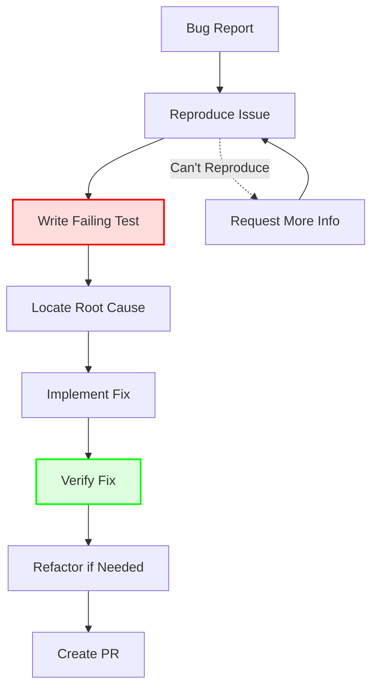

# 🐛 Fixing Bugs

A systematic approach to debugging and fixing issues in the codebase.

## Bug Fixing Process



## Step-by-Step Guide

### 1. Understand the Bug

#### Read the Report
```markdown
## Bug Report Template
**Description**: Timer doesn't pause when clicking pause button
**Expected**: Timer should pause and show paused state
**Actual**: Timer continues running
**Steps to Reproduce**:
1. Start timer
2. Click pause button
3. Observe timer still counting down

**Environment**:
- OS: Windows 11
- Version: 1.2.3
```

#### Gather Information
- Check logs
- Review related code
- Look for similar issues

### 2. Reproduce the Issue

#### Create Minimal Reproduction
```rust
// tests/bugs/timer_pause_issue.rs
#[tokio::test]
async fn timer_should_pause_when_pause_clicked() {
    let context = TestContext::new().await;
    
    // Start timer
    context.start_timer().await;
    assert_eq!(context.timer_state(), TimerState::Running);
    
    // Attempt to pause
    context.pause_timer().await;
    
    // This should fail, demonstrating the bug
    assert_eq!(context.timer_state(), TimerState::Paused); // FAILS!
}
```

### 3. Locate Root Cause

#### Debug Techniques

##### Add Logging
```rust
// domain/src/timer/timer.rs
pub fn pause(&mut self) -> Result<TimerPaused> {
    log::debug!("Pause called, current state: {:?}", self.state);
    
    match self.state {
        TimerState::Running => {
            log::debug!("Transitioning to paused");
            self.state = TimerState::Paused;
            // ...
        }
        _ => {
            log::warn!("Cannot pause from state: {:?}", self.state);
            return Err(DomainError::InvalidStateTransition);
        }
    }
}
```

##### Use Debugger
```rust
#[tokio::test]
async fn debug_pause_issue() {
    let mut timer = Timer::new();
    timer.start().unwrap();
    
    // Set breakpoint here
    dbg!(&timer.state);
    
    let result = timer.pause();
    dbg!(&result);
    dbg!(&timer.state);
}
```

##### Trace Execution
```rust
// infra/src/commands/timer_cmd.rs
#[tauri::command]
pub async fn pause_timer(state: State<'_, AppState>) -> Result<(), String> {
    println!("Command: pause_timer called");
    
    let use_case = state.pause_timer_use_case();
    println!("Use case retrieved");
    
    let result = use_case.execute().await;
    println!("Use case executed: {:?}", result);
    
    result.map_err(|e| e.to_string())
}
```

### 4. Common Bug Patterns

#### State Management Issues
```rust
// BUG: State not persisted
pub async fn pause(&mut self) -> Result<()> {
    self.state = TimerState::Paused;
    // Forgot to save!
    // self.repository.save(self).await?;
    Ok(())
}

// FIX: Persist state
pub async fn pause(&mut self) -> Result<()> {
    self.state = TimerState::Paused;
    self.repository.save(self).await?; // Added
    Ok(())
}
```

#### Race Conditions
```rust
// BUG: Concurrent access issues
pub async fn update_timer(&self) -> Result<()> {
    let timer = self.repository.get().await?;
    timer.tick();
    self.repository.save(timer).await?;
}

// FIX: Use proper locking
pub async fn update_timer(&self) -> Result<()> {
    let mut timer = self.repository.get_locked().await?;
    timer.tick();
    timer.save().await?;
}
```

#### Event Handling
```rust
// BUG: Event not published
pub async fn complete_phase(&mut self) -> Result<()> {
    self.phase = Phase::Break;
    // Forgot to publish event!
    Ok(())
}

// FIX: Publish event
pub async fn complete_phase(&mut self) -> Result<()> {
    self.phase = Phase::Break;
    self.event_bus.publish(PhaseCompleted {
        timer_id: self.id.clone(),
        phase: self.phase.clone(),
    }).await?;
    Ok(())
}
```

### 5. Implement the Fix

#### Write Test First
```rust
#[test]
fn timer_pauses_from_running_state() {
    let mut timer = Timer::new();
    timer.start().unwrap();
    
    let result = timer.pause();
    
    assert!(result.is_ok());
    assert_eq!(timer.state(), TimerState::Paused);
}
```

#### Fix the Code
```rust
// domain/src/timer/transitions.rs
impl Timer {
    pub fn pause(&mut self) -> Result<TimerPaused> {
        // Fixed: Check for Running state specifically
        if self.state != TimerState::Running {
            return Err(DomainError::InvalidStateTransition);
        }
        
        self.state = TimerState::Paused;
        self.paused_at = Some(Timestamp::now());
        
        Ok(TimerPaused {
            timer_id: self.id.clone(),
            paused_at: self.paused_at.unwrap(),
        })
    }
}
```

### 6. Verify the Fix

#### Run All Related Tests
```bash
# Run domain tests
cargo test -p domain timer::

# Run use case tests
cargo test -p usecases pause

# Run integration tests
cargo test --test timer_integration

# Run the specific bug test
cargo test timer_should_pause_when_pause_clicked
```

#### Manual Testing
1. Build the application
2. Start timer
3. Click pause
4. Verify timer pauses
5. Test edge cases

### 7. Prevent Regression

#### Add Comprehensive Tests
```rust
#[cfg(test)]
mod pause_tests {
    use super::*;

    #[test]
    fn pause_from_running_succeeds() {
        // Test normal case
    }
    
    #[test]
    fn pause_from_idle_fails() {
        // Test error case
    }
    
    #[test]
    fn pause_from_paused_fails() {
        // Test idempotency
    }
    
    #[test]
    fn pause_preserves_elapsed_time() {
        // Test state preservation
    }
}
```

## Bug Categories

### Domain Logic Bugs
- State machine errors
- Validation failures
- Business rule violations

### Infrastructure Bugs
- Persistence issues
- External service failures
- Configuration problems

### UI Bugs
- Rendering issues
- Event handling problems
- State synchronization

### Performance Bugs
- Memory leaks
- Slow queries
- Blocking operations

## Debugging Tools

### Logging
```rust
// Add targeted logging
log::debug!("Timer state before: {:?}", timer.state);
timer.pause()?;
log::debug!("Timer state after: {:?}", timer.state);
```

### Tracing
```rust
use tracing::{instrument, span, Level};

#[instrument]
pub async fn pause_timer(&self) -> Result<()> {
    let span = span!(Level::DEBUG, "pause_timer");
    let _enter = span.enter();
    
    // Implementation
}
```

### Profiling
```rust
use std::time::Instant;

let start = Instant::now();
expensive_operation().await;
println!("Operation took: {:?}", start.elapsed());
```

## Bug Report Template

```markdown
## Bug Report

### Summary
[One line description]

### Environment
- OS: [e.g., Windows 11]
- Version: [e.g., 1.2.3]
- Rust Version: [e.g., 1.70.0]

### Steps to Reproduce
1. [First step]
2. [Second step]
3. [...]

### Expected Behavior
[What should happen]

### Actual Behavior
[What actually happens]

### Logs
```
[Paste relevant logs]
```

### Screenshots
[If applicable]

### Additional Context
[Any other relevant information]
```

## Fix Checklist

- [ ] Bug reproduced locally
- [ ] Failing test written
- [ ] Root cause identified
- [ ] Fix implemented
- [ ] All tests pass
- [ ] No new bugs introduced
- [ ] Code reviewed
- [ ] Documentation updated

## Common Mistakes

### 1. Fixing Symptoms
❌ Patch the immediate issue
✅ Find and fix root cause

### 2. No Test Coverage
❌ Fix without tests
✅ Write test that catches bug

### 3. Incomplete Fix
❌ Fix one case
✅ Handle all edge cases

### 4. Breaking Other Features
❌ Focus only on bug
✅ Run full test suite

## Next Steps
- See [Testing Workflow](./testing.md)
- Learn [Code Review](./code-review.md)
- Review [Adding Features](./adding-feature.md)