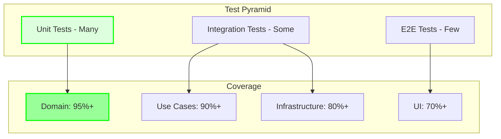

# 🧪 Testing Workflow

Comprehensive guide to testing at all layers of the application.

## Testing Strategy



## Test Organization

```
tests/
├── unit/           # Fast, isolated tests
├── integration/    # Component integration
├── e2e/           # Full system tests
└── performance/   # Performance benchmarks
```

## Layer-Specific Testing

### Domain Layer Tests

#### Unit Tests
```rust
// domain/src/timer/tests.rs
#[cfg(test)]
mod tests {
    use super::*;

    #[test]
    fn timer_starts_from_idle() {
        // Arrange
        let mut timer = Timer::new(test_config());
        
        // Act
        let result = timer.start(None);
        
        // Assert
        assert!(result.is_ok());
        assert_eq!(timer.state(), TimerState::Running);
    }
    
    #[test]
    fn timer_cannot_start_when_running() {
        // Arrange
        let mut timer = Timer::new(test_config());
        timer.start(None).unwrap();
        
        // Act
        let result = timer.start(None);
        
        // Assert
        assert!(matches!(
            result,
            Err(DomainError::InvalidStateTransition)
        ));
    }
}
```

#### Property-Based Tests
```rust
use proptest::prelude::*;

proptest! {
    #[test]
    fn timer_elapsed_never_exceeds_duration(
        seconds in 0u64..86400u64
    ) {
        let config = TimerConfiguration {
            work_duration: Duration::from_secs(seconds),
            ..Default::default()
        };
        
        let mut timer = Timer::new(config);
        timer.start(None).unwrap();
        
        // Simulate many ticks
        for _ in 0..seconds * 2 {
            timer.tick();
        }
        
        assert!(timer.elapsed() <= timer.total_duration());
    }
}
```

### Use Case Layer Tests

#### Integration Tests with Mocks
```rust
// usecases/tests/start_timer_tests.rs
use mockall::mock;

mock! {
    TimerRepo {}
    
    #[async_trait]
    impl TimerRepository for TimerRepo {
        async fn get_current(&self) -> Result<Timer>;
        async fn save(&self, timer: &Timer) -> Result<()>;
    }
}

#[tokio::test]
async fn start_timer_publishes_event() {
    // Arrange
    let mut timer_repo = MockTimerRepo::new();
    timer_repo.expect_get_current()
        .returning(|| Ok(Timer::new(default_config())));
    timer_repo.expect_save()
        .returning(|_| Ok(()));
    
    let event_bus = Arc::new(TestEventBus::new());
    
    let use_case = StartTimerSession::new(
        Arc::new(timer_repo),
        event_bus.clone(),
    );
    
    // Act
    let result = use_case.execute(None).await;
    
    // Assert
    assert!(result.is_ok());
    assert_eq!(event_bus.published_events().len(), 1);
    assert!(event_bus.last_event().is::<TimerStarted>());
}
```

### Infrastructure Layer Tests

#### Repository Tests
```rust
// infra/tests/task_repository_tests.rs
#[tokio::test]
async fn file_repository_persists_tasks() {
    // Arrange
    let temp_dir = tempfile::tempdir().unwrap();
    let repo = FileTaskRepository::new(temp_dir.path().to_path_buf());
    let task = Task::new("Test Task".to_string());
    
    // Act
    repo.save(&task).await.unwrap();
    let loaded = repo.find(task.id()).await.unwrap();
    
    // Assert
    assert_eq!(loaded, Some(task));
}

#[tokio::test]
async fn repository_handles_concurrent_access() {
    let repo = Arc::new(FileTaskRepository::new(test_dir()));
    let task = Arc::new(Task::new("Concurrent Task".to_string()));
    
    // Spawn multiple concurrent operations
    let handles: Vec<_> = (0..10)
        .map(|i| {
            let repo = repo.clone();
            let mut task = (*task).clone();
            tokio::spawn(async move {
                task.update_name(format!("Task {}", i));
                repo.save(&task).await
            })
        })
        .collect();
    
    // Wait for all to complete
    for handle in handles {
        handle.await.unwrap().unwrap();
    }
    
    // Verify final state
    let final_task = repo.find(task.id()).await.unwrap();
    assert!(final_task.is_some());
}
```

### UI Layer Tests

#### Component Tests
```tsx
// apps/react-ui/src/pages/__tests__/TimerDisplay.test.tsx
import { render, screen } from "@testing-library/react";
import { TimerDisplay } from "../TimerPage";

test("timer display shows correct time", () => {
    // Arrange
    render(<TimerDisplay minutes={25} seconds={0} isRunning={false} />);

    // Assert
    expect(screen.getByText("25:00")).toBeInTheDocument();
});

test("start button triggers command", async () => {
    // Arrange
    const invoke = vi.fn().mockResolvedValue({ status: "Running" });
    render(<TimerControls invoke={invoke} />);

    // Act
    const button = screen.getByRole("button", { name: /start/i });
    button.click();

    // Assert (await async flush)
    await screen.findByText("Running");
    expect(invoke).toHaveBeenCalledWith("start_timer");
});
```

## End-to-End Tests

### Complete Workflow Tests
```rust
// tests/e2e/pomodoro_workflow.rs
#[tokio::test]
async fn complete_pomodoro_session() {
    let app = TestApp::spawn().await;
    
    // Create and start task
    let task_id = app.create_task("E2E Test Task", 4).await;
    app.start_timer(Some(task_id.clone())).await;
    
    // Complete work session
    app.advance_time(Duration::from_secs(25 * 60)).await;
    
    // Verify break started
    let state = app.get_timer_state().await;
    assert_eq!(state.phase, "short_break");
    assert_eq!(state.remaining_seconds, 5 * 60);
    
    // Complete break
    app.advance_time(Duration::from_secs(5 * 60)).await;
    
    // Verify next work session
    let state = app.get_timer_state().await;
    assert_eq!(state.phase, "work");
    
    // Verify task updated
    let task = app.get_task(task_id).await;
    assert_eq!(task.sessions_completed, 1);
}
```

## Test Utilities

### Test Builders
```rust
// tests/helpers/builders.rs
pub struct TaskBuilder {
    name: String,
    estimated_sessions: u32,
    status: TaskStatus,
}

impl TaskBuilder {
    pub fn new() -> Self {
        Self {
            name: "Test Task".to_string(),
            estimated_sessions: 4,
            status: TaskStatus::Active,
        }
    }
    
    pub fn with_name(mut self, name: &str) -> Self {
        self.name = name.to_string();
        self
    }
    
    pub fn completed(mut self) -> Self {
        self.status = TaskStatus::Completed;
        self
    }
    
    pub fn build(self) -> Task {
        let mut task = Task::new(self.name);
        task.set_estimated_sessions(self.estimated_sessions);
        task.set_status(self.status);
        task
    }
}

// Usage
let task = TaskBuilder::new()
    .with_name("Custom Task")
    .completed()
    .build();
```

### Test Context
```rust
// tests/helpers/context.rs
pub struct TestContext {
    pub timer_repo: Arc<InMemoryTimerRepository>,
    pub task_repo: Arc<InMemoryTaskRepository>,
    pub event_bus: Arc<TestEventBus>,
    pub app_state: AppState,
}

impl TestContext {
    pub async fn new() -> Self {
        let timer_repo = Arc::new(InMemoryTimerRepository::new());
        let task_repo = Arc::new(InMemoryTaskRepository::new());
        let event_bus = Arc::new(TestEventBus::new());
        
        let app_state = AppState::new_with_repos(
            timer_repo.clone(),
            task_repo.clone(),
            event_bus.clone(),
        );
        
        Self {
            timer_repo,
            task_repo,
            event_bus,
            app_state,
        }
    }
    
    pub async fn create_task(&self, name: &str) -> TaskId {
        let use_case = self.app_state.create_task_use_case();
        let task = use_case.execute(name.to_string()).await.unwrap();
        TaskId::from_str(&task.id).unwrap()
    }
    
    pub async fn start_timer(&self, task_id: Option<TaskId>) {
        let use_case = self.app_state.start_timer_use_case();
        use_case.execute(task_id).await.unwrap();
    }
}
```

## Test Patterns

### Arrange-Act-Assert
```rust
#[test]
fn follows_aaa_pattern() {
    // Arrange: Set up test data
    let mut timer = Timer::new(test_config());
    
    // Act: Perform the action
    let result = timer.start(None);
    
    // Assert: Verify the outcome
    assert!(result.is_ok());
    assert_eq!(timer.state(), TimerState::Running);
}
```

### Given-When-Then
```rust
#[test]
fn given_when_then_style() {
    // Given a timer in idle state
    let mut timer = Timer::new(test_config());
    assert_eq!(timer.state(), TimerState::Idle);
    
    // When the timer is started
    let result = timer.start(None);
    
    // Then it should be running
    assert!(result.is_ok());
    assert_eq!(timer.state(), TimerState::Running);
}
```

### Table-Driven Tests
```rust
#[test]
fn state_transitions() {
    let test_cases = vec![
        (TimerState::Idle, TimerAction::Start, Some(TimerState::Running)),
        (TimerState::Running, TimerAction::Pause, Some(TimerState::Paused)),
        (TimerState::Paused, TimerAction::Resume, Some(TimerState::Running)),
        (TimerState::Running, TimerAction::Reset, Some(TimerState::Idle)),
        (TimerState::Idle, TimerAction::Pause, None), // Invalid
    ];
    
    for (initial, action, expected) in test_cases {
        let mut timer = Timer::with_state(initial);
        let result = timer.apply_action(action);
        
        match expected {
            Some(state) => {
                assert!(result.is_ok());
                assert_eq!(timer.state(), state);
            }
            None => {
                assert!(result.is_err());
            }
        }
    }
}
```

## Coverage & Metrics

### Running Coverage
```bash
# Install tarpaulin
cargo install cargo-tarpaulin

# Run with coverage
cargo tarpaulin --out Html --output-dir coverage

# With specific threshold
cargo tarpaulin --min 80
```

### Coverage by Layer
```bash
# Domain layer (should be highest)
cargo tarpaulin -p domain --min 95

# Use cases
cargo tarpaulin -p usecases --min 90

# Infrastructure
cargo tarpaulin -p infra --min 80
```

## Test Commands

### Running Tests
```bash
# All tests
cargo test --workspace

# Specific package
cargo test -p domain

# Specific test
cargo test timer_starts_from_idle

# With output
cargo test -- --nocapture

# In release mode
cargo test --release

# Parallel execution
cargo test -- --test-threads=4
```

### Watch Mode
```bash
# Install cargo-watch
cargo install cargo-watch

# Watch and test
cargo watch -x test

# Watch specific package
cargo watch -x "test -p domain"
```

## Best Practices

### Do's ✅
- Write tests first (TDD)
- Keep tests simple and focused
- Use descriptive test names
- Test edge cases
- Mock external dependencies
- Clean up test resources

### Don'ts ❌
- Don't test implementation details
- Don't create brittle tests
- Don't skip error cases
- Don't share state between tests
- Don't ignore flaky tests
- Don't test framework code

## Debugging Failed Tests

### Get More Output
```bash
# Show println! output
cargo test -- --nocapture

# Show backtrace
RUST_BACKTRACE=1 cargo test

# Run single test
cargo test exact_test_name -- --exact
```

### Use Debug Assertions
```rust
#[test]
fn debug_test() {
    let value = complex_calculation();
    
    // Add debug output
    dbg!(&value);
    
    // Use debug assertions
    debug_assert_eq!(value.internal_state, expected);
    
    assert_eq!(value.result(), 42);
}
```

## Next Steps
- See [Code Review](./code-review.md)
- Learn [Adding Features](./adding-feature.md)
- Review [Fixing Bugs](./fixing-bugs.md)