# Domain Layer Architecture

## Overview

The domain layer implements the core business logic for the Pomodoro timer application following Domain-Driven Design (DDD) principles. It contains all business entities, value objects, domain services, and events.

## Module Structure

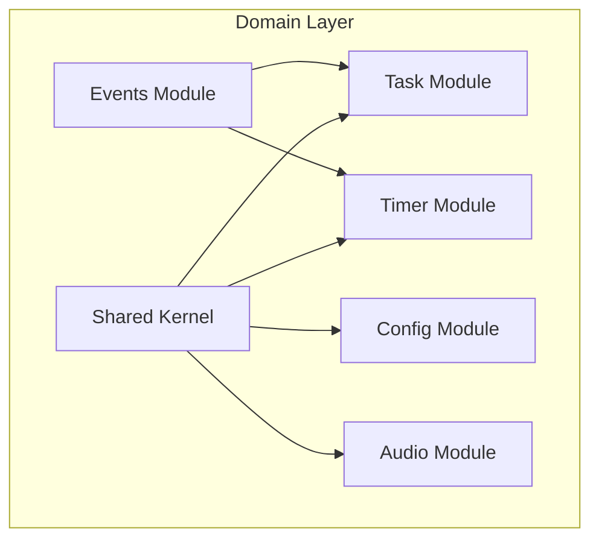

## Core Modules

### 1. Shared Kernel
Common domain primitives and interfaces used across all modules.

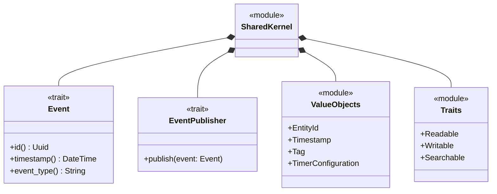

### 2. Task Module
Manages task entities and their lifecycle.

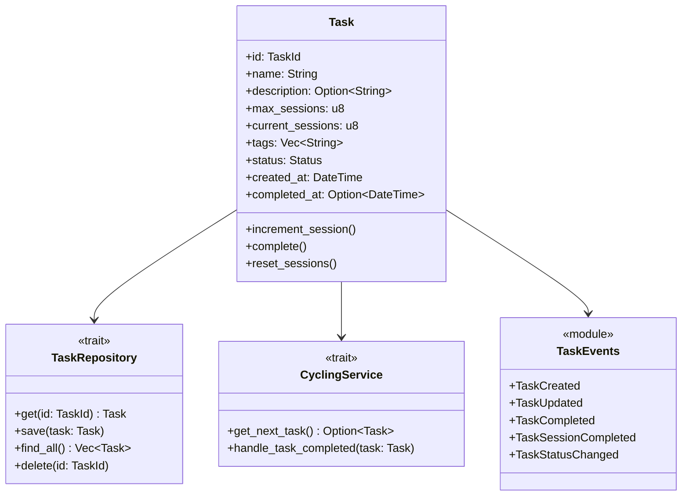

### 3. Timer Module
Implements the Pomodoro timer state machine.

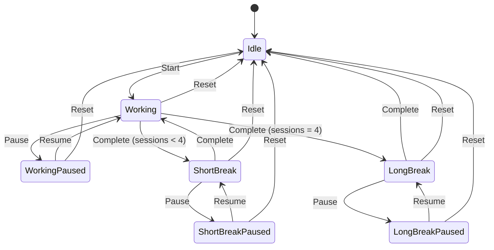

### Timer State Machine Implementation

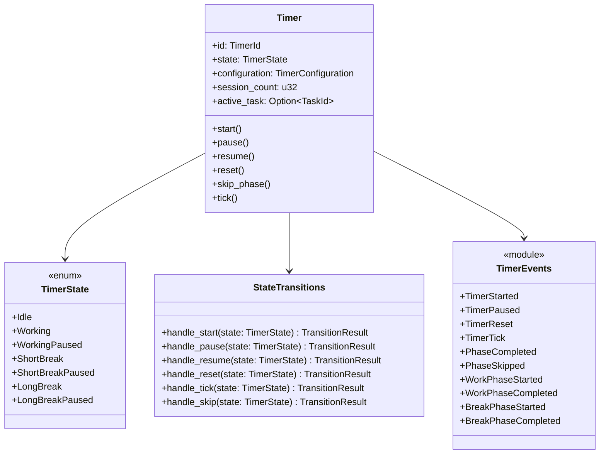

## Event Flow

### Timer Lifecycle Events

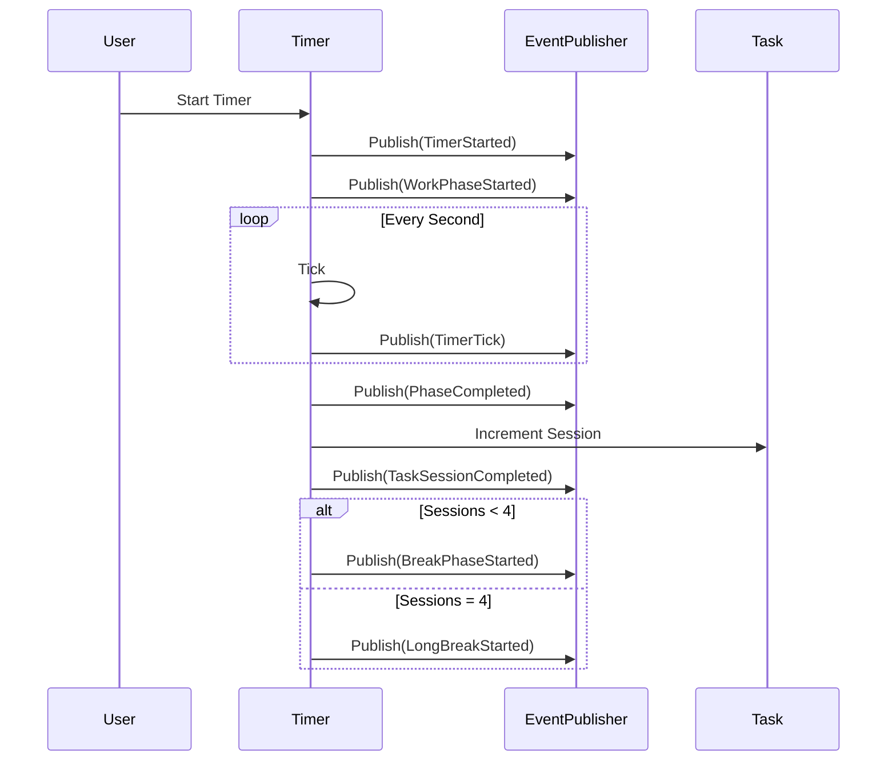

### Task Completion Flow

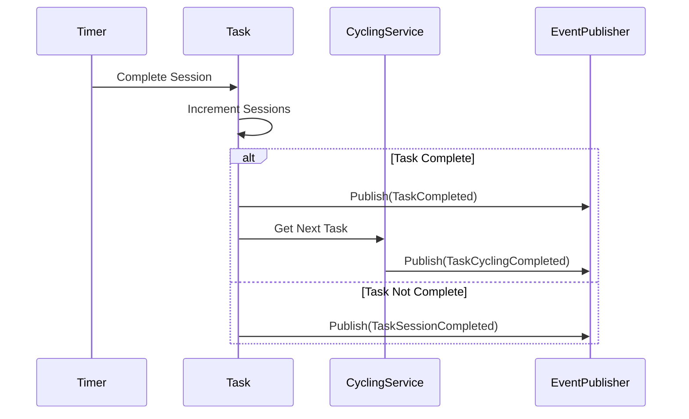

## Domain Boundaries

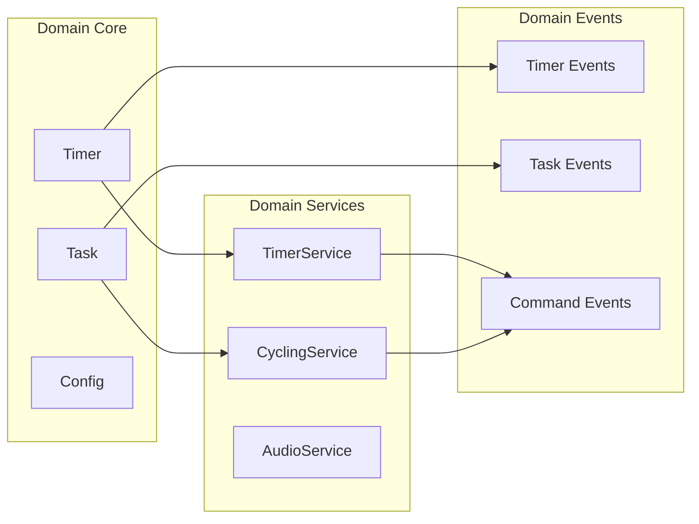

## Repository Pattern

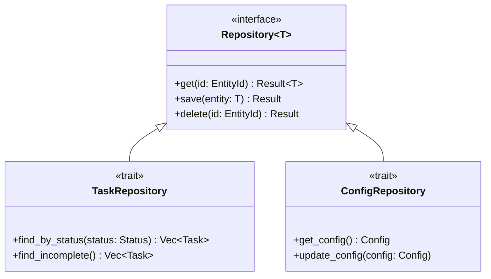

## Value Objects

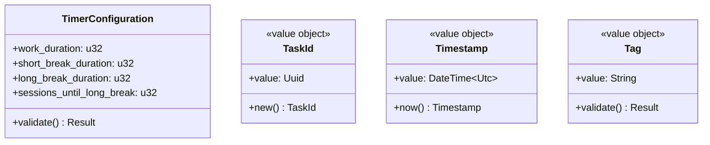

## Error Handling

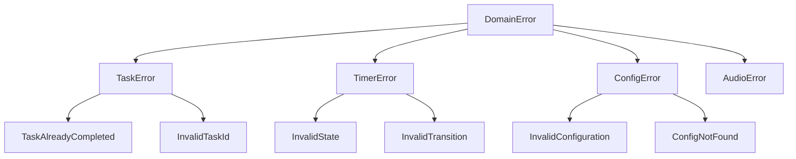

## Cross-Cutting Concerns

### Event Publishing

All domain modules publish events through the EventPublisher trait, enabling:
- Decoupled communication between modules
- Audit logging
- State synchronization
- UI updates

### Persistence

Domain entities are persistence-agnostic, using repository traits that can be implemented by the infrastructure layer.

### Validation

Each domain entity validates its invariants:
- Tasks must have valid session counts
- Timer states must follow valid transitions
- Configurations must have reasonable durations

## Design Patterns Used

1. **State Pattern**: Timer state machine
2. **Repository Pattern**: Data access abstraction
3. **Factory Pattern**: Task and Timer builders
4. **Strategy Pattern**: Task cycling strategies
5. **Domain Events**: Event-driven architecture
6. **Value Objects**: Immutable domain primitives