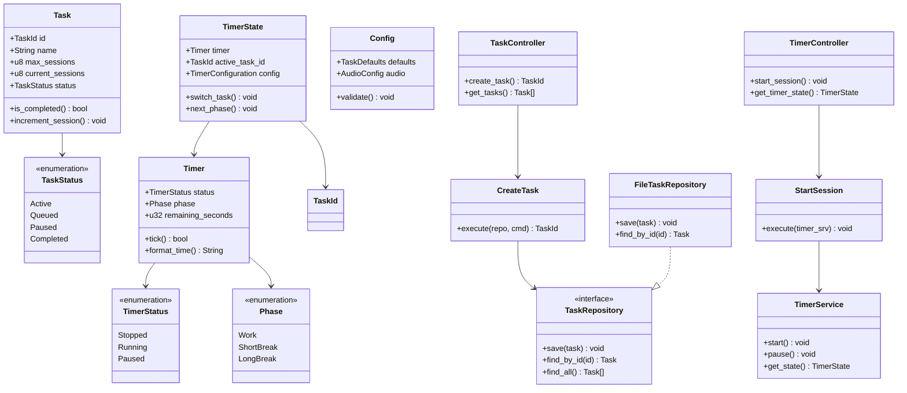

# Pomotoro Application - Object Relationships

## Architecture Overview

### Domain Layer (Pure Business Logic)
- **Task**: Core entity managing pomodoro sessions
- **Timer**: Countdown logic and phase management
- **TimerState**: Orchestrates timer with active task
- **Config**: Global application settings

### Application Layer (Use Cases)
- **CreateTask**: Creates new tasks with validation
- **StartSession**: Initiates timer sessions
- **UpdateTask**: Modifies existing tasks
- **SwitchTask**: Changes active task

### Infrastructure Layer (Technical Implementation)
- **FileTaskRepository**: File-based task persistence
- **TimerService**: Timer state management
- **AudioService**: Sound and notification handling
- **NotificationService**: System notifications

### Presentation Layer (External Interface)
- **TaskController**: Task-related API endpoints
- **TimerController**: Timer control endpoints
- **AudioController**: Audio management endpoints

## Key Object Interactions

1. **Task Management Flow**:
   - UI → TaskController → CreateTask → TaskRepository → File System

2. **Timer Session Flow**:
   - UI → TimerController → StartSession → TimerService → TimerState → Timer

3. **Task Switching Flow**:
   - UI → TaskController → SwitchTask → TimerService + TaskRepository

4. **Configuration Flow**:
   - UI → ConfigController → ConfigRepository → File System

5. **Event Flow**:
   - Domain Entities → Events → Infrastructure Services → External Systems

## Design Principles

- **Clean Architecture**: Dependencies point inward toward domain
- **Domain-Driven Design**: Rich domain models with business logic
- **Dependency Inversion**: Interfaces in domain, implementations in infrastructure
- **Single Responsibility**: Each class has one reason to change
- **Event-Driven**: Loose coupling through domain events