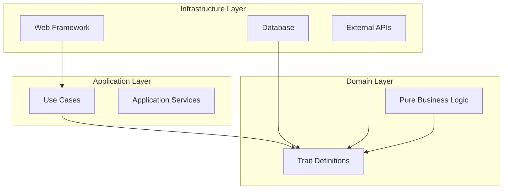

# Project Development Guidelines

## Architecture Overview

This project follows a hybrid architecture combining **Clean Architecture** principles with **Domain-Driven Design (DDD)** tactical patterns, implemented in idiomatic Rust.



## Core Principles

### 1. Architecture Layers

#### Domain Layer
- **Purpose**: Core business logic and rules
- **Rules**:
  - No I/O operations
  - No external dependencies
  - No application or usecase services
  - Define traits/interfaces for external dependencies

#### Application Layer
- **Purpose**: Orchestrate domain logic and infrastructure
- **Rules**:
  - Use dependency injection
  - All services should be a pure functions
  - Pure functions and data structures
  - Coordinate between domain and infrastructure
  - Handle transaction boundaries
  - Implement use cases

#### Infrastructure Layer
- **Purpose**: External system integrations
- **Rules**:
  - Implement domain-defined traits
  - Handle all I/O operations
  - Manage technical concerns (DB, APIs, frameworks)

### 2. Development Workflow

#### Planning Phase (Ultra Think Protocol)

Before implementing any feature:

1. **Analyze the domain** - Understand business requirements
2. **Map bounded contexts** - Identify domain boundaries
3. **Design contracts** - Define trait interfaces
4. **Plan evolution paths** - Document future possibilities
5. **Verify architecture fit** - Ensure alignment with principles

#### Implementation Phase

Follow this order:
1. Define domain models and traits
2. Implement use cases with dependency injection
3. Create infrastructure implementations
4. Wire everything together in main/configuration

## Code Organization

### File Structure

See the [file-structure guide](./file-structure.md).

### Naming Conventions

#### Context-Aware Naming

Names should be relative to their module context:

```rust
// ✅ CORRECT
domain/task/error.rs     // Contains: Error (not TaskError)
domain/task/events.rs    // Contains: Completed (not TaskCompleted)

// ❌ WRONG
domain/task/task_error.rs  // Redundant prefix
domain/domain_error.rs      // Redundant prefix
```

Rule of Thumb
If the module path provides sufficient context, use the generic name. The path task::Error is clearer and more idiomatic than task::TaskError.

#### File Organization Rules

See the [file-structure guide](./file-structure.md) for the full layout.


## Code Templates

See the [code templates](./code-templates.md) for copy-paste entity/repository/use-case skeletons.

## Error Handling

### Layer-Specific Errors

#### Domain Layer
```rust
#[derive(Debug, thiserror::Error)]
pub enum Error {
    #[error("invalid state transition")]
    InvalidTransition,

    #[error("business rule violation: {0}")]
    RuleViolation(String),
}
```

#### Application Layer
```rust
#[derive(Debug, thiserror::Error)]
pub enum Error {
    #[error("entity not found")]
    NotFound,

    #[error(transparent)]
    Domain(#[from] domain::Error),

    #[error(transparent)]
    Infrastructure(#[from] infra::Error),
}
```

#### Infrastructure Layer
```rust
#[derive(Debug, thiserror::Error)]
pub enum Error {
    #[error("database connection failed")]
    DatabaseConnection(#[source] sqlx::Error),

    #[error("external service timeout")]
    ServiceTimeout,
}
```

## Testing Strategy

### Domain Tests
```rust
#[cfg(test)]
mod tests {
    use super::*;

    #[test]
    fn test_business_rule() {
        let mut entity = Entity::new(/* ... */).unwrap();
        let result = entity.operation();
        assert!(result.is_ok());
    }
}
```

### Application Tests
```rust
#[cfg(test)]
mod tests {
    use super::*;
    use mockall::mock;

    mock! {
        Repo {}

        #[async_trait]
        impl Repository for Repo {
            async fn find(&self, id: Id) -> Result<Entity, Error>;
        }
    }

    #[tokio::test]
    async fn test_use_case() {
        let mut mock_repo = MockRepo::new();
        mock_repo.expect_find().returning(|_| Ok(/* ... */));

        let result = use_case(&mock_repo, cmd).await;
        assert!(result.is_ok());
    }
}
```

## Import Guidelines

### Rules
- **Never use glob imports** (`use module::*`) in production code
- Be explicit about imported items
- Group imports logically (std, external crates, internal modules)

### Exceptions
- Test modules: `use super::*`
- Well-known preludes: `tokio::prelude::*`
- Team-designed prelude modules

### Enforcement
Enable clippy lint: `clippy::wildcard_imports`

## Documentation Standards

### Evolution-First Documentation

```rust
/// Current: Basic CRUD operations for tasks
///
/// TODO: Evolution roadmap:
/// - v2: Add task templates for recurring patterns
/// - v3: Integrate with calendar systems
/// - v4: ML-based task duration predictions
///
/// # Design Decisions
/// - Using event sourcing ready patterns
/// - Repository trait for swappable persistence
/// - Command pattern for audit trail capability
pub mod task {
    // Implementation
}
```

## Common Pitfalls to Avoid

### ❌ Domain Layer Violations
```rust
// WRONG: I/O in domain
impl Task {
    pub async fn save(&self, db: &Database) { }
}
```

### ❌ Missing Dependency Injection
```rust
// WRONG: Hard-coded dependency
pub async fn complete_task(task_id: TaskId) {
    let db = Database::connect().await;  // NO!
}
```

### ❌ Redundant Naming
```rust
// WRONG: Repetitive prefixes
domain/task/task_error.rs
domain/task/task_repository.rs
```

### ❌ Mixed Concerns
```rust
// WRONG: Business logic in infrastructure
impl PostgresRepository {
    async fn complete_task(&self, id: TaskId) {
        // Business logic here - NO!
    }
}
```

## Code Review Checklist

### Architecture
- [ ] Domain layer contains no I/O operations
- [ ] Use cases use dependency injection
- [ ] Infrastructure implements domain traits
- [ ] Layer boundaries are respected

### Code Organization
- [ ] Files follow size guidelines (<150 lines)
- [ ] Related items are properly grouped
- [ ] Context-aware naming is used
- [ ] No glob imports in production code

### Documentation
- [ ] Evolution paths documented with TODO
- [ ] Design decisions explained
- [ ] Public APIs have doc comments

### Testing
- [ ] Domain logic has unit tests
- [ ] Use cases have integration tests with mocks
- [ ] Critical paths have end-to-end tests

## Performance Considerations

### Priority Order
1. **Architectural Integrity** - Maintain layer boundaries
2. **Domain Purity** - No I/O in domain logic
3. **Evolution Readiness** - Design for future changes
4. **Idiomatic Rust** - Follow community patterns
5. **Performance** - Optimize when measured

### Optimization Guidelines
- Profile before optimizing
- Maintain architectural boundaries even when optimizing
- Document performance-critical sections
- Consider caching at appropriate layers

## Evolution and Refactoring

### Adding New Features
1. Start with domain model changes
2. Update/add repository traits
3. Create/modify use cases
4. Implement infrastructure changes
5. Update API/UI layers

### Refactoring Existing Code
1. Identify architectural violations
2. Plan migration path
3. Create new structure alongside old
4. Migrate incrementally
5. Remove old code once verified

## Team Agreements

### Definition of Done
- [ ] Code follows architecture guidelines
- [ ] Tests pass (unit, integration, e2e as applicable)
- [ ] Documentation updated
- [ ] Code reviewed by team member
- [ ] Evolution TODOs added for future work

### Pull Request Standards
- Clear description of changes
- Architecture impact assessment
- Link to related issues/tickets
- Screenshots/examples for UI changes

## Quick Reference

### Layer Responsibilities

| Layer | Can Do | Cannot Do |
|-------|--------|-----------|
| Domain | Define business rules, Pure calculations, Raise domain events | I/O operations, Call infrastructure, Use frameworks |
| Application | Orchestrate workflow, Transaction management, Call repositories | Contain business logic, Direct I/O operations |
| Infrastructure | Database queries, API calls, Framework integration | Business rules, Domain logic |

### Common Patterns

| Pattern | Use Case | Layer |
|---------|----------|-------|
| Repository | Data persistence abstraction | Domain trait, Infrastructure impl |
| Factory | Complex object creation | Domain |
| Domain Service | Cross-aggregate operations | Domain |
| Application Service | Use case orchestration | Application |
| Adapter | External system integration | Infrastructure |

## Conclusion

This guideline ensures our codebase remains maintainable, testable, and evolvable. When in doubt:

1. Respect layer boundaries
2. Keep domain pure
3. Use dependency injection
4. Document evolution paths
5. Follow Rust idioms

Remember: You are an architectural guardian. Every line of code should reinforce these principles and guide toward a maintainable, evolvable system.