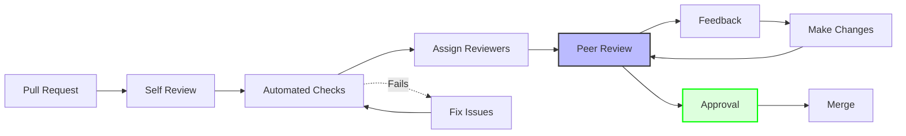

# 👀 Code Review Process

Guidelines for conducting and participating in code reviews.

## Review Process Flow



## Pull Request Template

```markdown
## Description
Brief description of changes and why they're needed.

## Type of Change
- [ ] Bug fix (non-breaking change fixing an issue)
- [ ] New feature (non-breaking change adding functionality)
- [ ] Breaking change (fix or feature causing existing functionality to change)
- [ ] Documentation update
- [ ] Performance improvement
- [ ] Refactoring

## Changes Made
- Added/Modified/Removed X to achieve Y
- Updated Z to fix issue #123

## Testing
- [ ] Unit tests pass
- [ ] Integration tests pass
- [ ] Manual testing completed
- [ ] E2E tests pass (if applicable)

## Screenshots (if applicable)
[Add screenshots for UI changes]

## Checklist
- [ ] Self-review completed
- [ ] Code follows project style guidelines
- [ ] Tests added/updated
- [ ] Documentation updated
- [ ] No new warnings
- [ ] Changes are backward compatible

## Related Issues
Closes #123
Related to #456
```

## As the Author

### 1. Self-Review First

#### Check Your Own Code
```bash
# Review your changes
git diff main...HEAD

# Check each file
git diff --stat

# Review commit messages
git log --oneline main...HEAD
```

#### Self-Review Checklist
- [ ] Does the code do what it's supposed to?
- [ ] Are there any obvious bugs?
- [ ] Is the code readable and clear?
- [ ] Are there adequate tests?
- [ ] Does it follow project conventions?
- [ ] Are there any security concerns?

### 2. Prepare for Review

#### Clean Up Commits
```bash
# Squash related commits
git rebase -i main

# Write clear commit messages
git commit --amend
```

#### Add Context
```markdown
## Review Notes
- Pay special attention to the timer state machine changes
- The new validation logic is in `domain/src/timer/transitions.rs`
- I'm unsure about the error handling in the use case layer
- Performance might be a concern in the event handler
```

### 3. Respond to Feedback

#### Address All Comments
```rust
// Reviewer: This could be more efficient
// Author: Good point! Updated to use HashMap for O(1) lookup

// Before
let task = tasks.iter().find(|t| t.id() == &id);

// After
let task = task_map.get(&id);
```

#### Explain Decisions
```markdown
> Why not use async here?

This operation is CPU-bound and very fast (< 1ms). Making it async would add unnecessary overhead without any benefit. The blocking operation doesn't affect the event loop.
```

## As the Reviewer

### 1. Review Approach

#### What to Look For

##### Architecture & Design
- Does it follow Clean Architecture principles?
- Are layer boundaries respected?
- Is the design extensible?

##### Code Quality
- Is the code readable and maintainable?
- Are there any code smells?
- Is there unnecessary complexity?

##### Testing
- Are tests comprehensive?
- Do tests cover edge cases?
- Are tests maintainable?

##### Performance
- Are there any obvious bottlenecks?
- Is memory usage reasonable?
- Are there unnecessary allocations?

##### Security
- Are inputs validated?
- Are errors handled properly?
- Are there any injection risks?

### 2. Providing Feedback

#### Be Constructive
```markdown
❌ Bad: "This is wrong"
✅ Good: "This could cause a race condition. Consider using a Mutex here."

❌ Bad: "Terrible naming"
✅ Good: "Could we use a more descriptive name? Maybe `process_timer_tick` instead of `handle`?"
```

#### Use Review Levels
```markdown
🔴 **Must Fix**: Critical issue that blocks merging
🟡 **Should Fix**: Important but not blocking
🟢 **Consider**: Suggestion for improvement
💭 **Thought**: Discussion point or question
✨ **Praise**: Highlighting good code
```

#### Code Suggestions
```diff
- let result = data.iter().filter(|x| x.is_valid()).collect();
+ let valid_items: Vec<_> = data
+     .iter()
+     .filter(|item| item.is_valid())
+     .collect();
```

### 3. Review Comments Examples

#### Domain Layer Review
```rust
// 🔴 Must Fix: Business logic violation
// This allows invalid state transitions
impl Timer {
    pub fn complete(&mut self) {
        self.state = TimerState::Completed; // Missing validation!
    }
}

// Suggested fix:
impl Timer {
    pub fn complete(&mut self) -> Result<(), DomainError> {
        match self.state {
            TimerState::Running => {
                self.state = TimerState::Completed;
                Ok(())
            }
            _ => Err(DomainError::InvalidStateTransition)
        }
    }
}
```

#### Use Case Review
```rust
// 🟡 Should Fix: Missing error handling
pub async fn execute(&self) -> Result<TaskDto> {
    let task = self.repo.find(id).await?; // What if None?
    Ok(TaskDto::from(task))
}

// Suggested:
pub async fn execute(&self) -> Result<TaskDto> {
    let task = self.repo.find(id).await?
        .ok_or(UseCaseError::TaskNotFound)?;
    Ok(TaskDto::from(task))
}
```

#### Performance Review
```rust
// 🟢 Consider: Performance improvement
// This creates unnecessary allocations
let names: Vec<String> = tasks
    .iter()
    .map(|t| t.name().to_string())
    .collect();

// Consider:
let names: Vec<&str> = tasks
    .iter()
    .map(|t| t.name().as_str())
    .collect();
```

## Review Checklist

### Architecture
- [ ] Follows Clean Architecture principles
- [ ] Respects layer boundaries
- [ ] No circular dependencies
- [ ] Proper separation of concerns

### Code Quality
- [ ] Clear and readable
- [ ] Follows project conventions
- [ ] No code duplication
- [ ] Appropriate abstraction level

### Testing
- [ ] Adequate test coverage
- [ ] Tests are meaningful
- [ ] Edge cases covered
- [ ] Tests follow AAA pattern

### Documentation
- [ ] Public APIs documented
- [ ] Complex logic explained
- [ ] README updated if needed
- [ ] Examples provided

### Performance
- [ ] No obvious bottlenecks
- [ ] Efficient algorithms used
- [ ] Appropriate data structures
- [ ] No unnecessary allocations

### Security
- [ ] Input validation present
- [ ] No hardcoded secrets
- [ ] Proper error handling
- [ ] Safe unwrapping

## Common Issues to Catch

### 1. Unwrap/Expect Usage
```rust
// ❌ Bad: Can panic
let value = some_option.unwrap();

// ✅ Good: Proper error handling
let value = some_option.ok_or(Error::MissingValue)?;
```

### 2. Missing Tests
```rust
// ❌ Bad: Complex logic without tests
pub fn calculate_score(data: &[Item]) -> u32 {
    // Complex calculation...
}

// ✅ Good: Tested logic
#[cfg(test)]
mod tests {
    #[test]
    fn calculate_score_handles_empty() { }
    
    #[test]
    fn calculate_score_sums_correctly() { }
}
```

### 3. Resource Leaks
```rust
// ❌ Bad: File not closed
let file = File::open(path)?;
// ... use file

// ✅ Good: Automatic cleanup
let contents = fs::read_to_string(path)?;
```

### 4. Race Conditions
```rust
// ❌ Bad: Unsafe concurrent access
static mut COUNTER: u32 = 0;

// ✅ Good: Thread-safe
use std::sync::atomic::{AtomicU32, Ordering};
static COUNTER: AtomicU32 = AtomicU32::new(0);
```

## Review Tools

### Automated Checks
```yaml
# .github/workflows/review.yml
name: Review Checks
on: [pull_request]

jobs:
  review:
    runs-on: ubuntu-latest
    steps:
      - uses: actions/checkout@v2
      
      - name: Format Check
        run: cargo fmt -- --check
      
      - name: Clippy
        run: cargo clippy -- -D warnings
      
      - name: Tests
        run: cargo test --workspace
      
      - name: Coverage
        run: cargo tarpaulin --min 80
```

### Local Review Tools
```bash
# Format check
cargo fmt -- --check

# Linting
cargo clippy -- -D warnings

# Security audit
cargo audit

# Dependency check
cargo outdated
```

## Best Practices

### Do's ✅
- Review promptly (within 24 hours)
- Be respectful and constructive
- Explain the "why" behind feedback
- Acknowledge good code
- Ask questions when unsure
- Test the changes locally

### Don'ts ❌
- Don't nitpick minor style issues
- Don't review when tired/frustrated
- Don't approve without understanding
- Don't block on personal preferences
- Don't skip testing the changes
- Don't ignore CI failures

## Approval Criteria

### Ready to Merge When:
- [ ] All CI checks pass
- [ ] Required reviews approved
- [ ] All feedback addressed
- [ ] No unresolved discussions
- [ ] Documentation updated
- [ ] Tests pass locally

## Next Steps
- See [Testing Workflow](./testing.md)
- Learn [Adding Features](./adding-a-feature.md)
- Review [Git Workflow](./development.md)