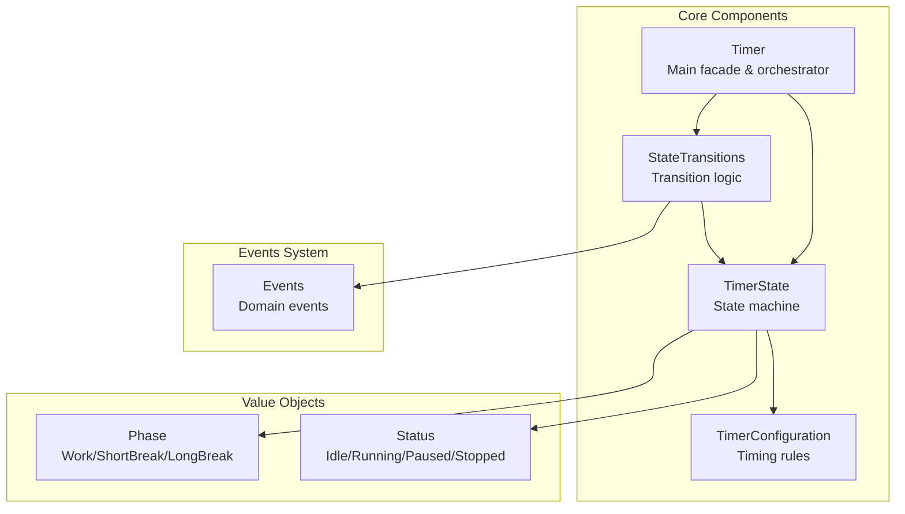
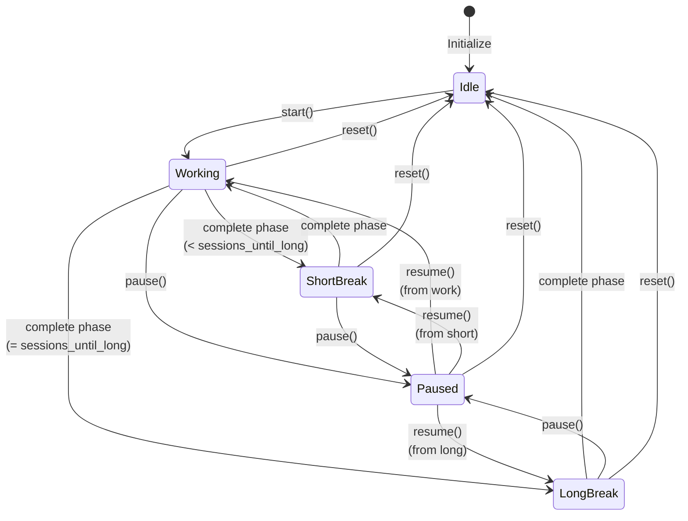
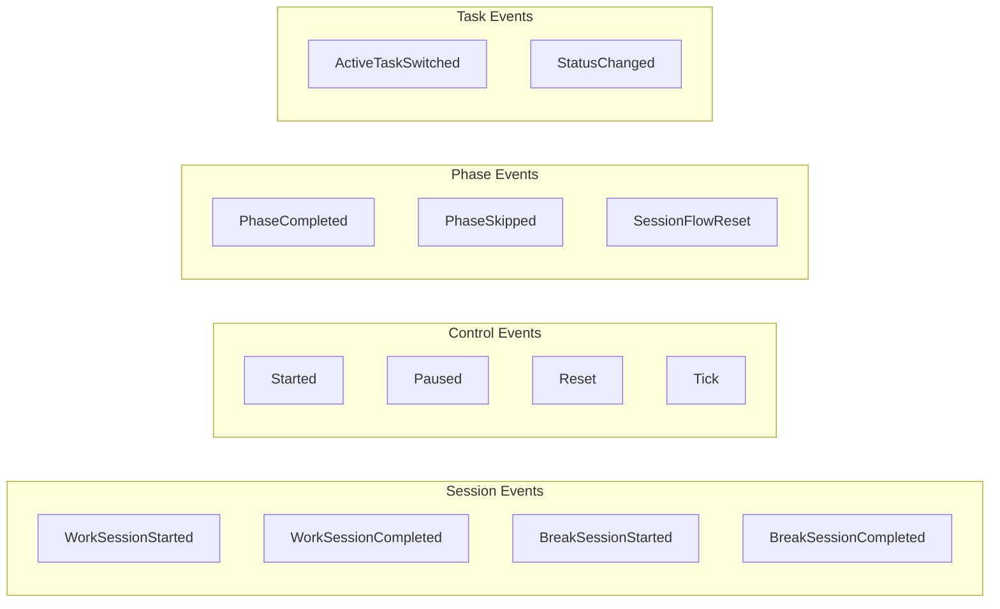
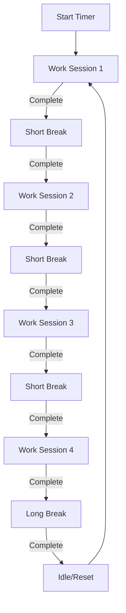

# Timer Module Guide

## Overview

The Timer module implements a Pomodoro timer system following Domain-Driven Design principles. It manages work sessions, breaks, and state transitions while maintaining clean separation of concerns and event-driven architecture.

## Architecture



## State Machine



## Core Components

### 1. Timer (`timer.rs`)
The main facade that orchestrates the timer functionality:
- **Purpose**: Provides the public API for timer operations
- **Responsibilities**:
  - State management
  - Command execution (start, pause, resume, skip, reset)
  - Progress tracking and display formatting
  - Returns events from state transitions
- **Key Methods**:
  - `start()`: Begin a work session
  - `pause()`: Pause the current phase
  - `resume()`: Resume from pause
  - `skip_phase()`: Skip to next phase
  - `tick()`: Decrement timer (called every second)
  - `set_active_entity()`: Associate timer with a task

### 2. TimerState (`state_machine.rs`)
Represents the timer's current state:
- **States**:
  - `Idle`: Timer stopped, waiting to start
  - `Working`: Active work session
  - `ShortBreak`: Short break between work sessions
  - `LongBreak`: Long break after multiple sessions
  - `Paused`: Any state can be paused
- **Data Tracked**:
  - `remaining_seconds`: Time left in current phase
  - `session_count`: Total completed work sessions
  - `active_entity`: Current task ID
  - `entity_session_count`: Sessions for current task
  - `configuration`: Timer settings

### 3. StateTransitions (`transitions.rs`)
Handles all state transition logic:
- **Purpose**: Enforce valid state transitions and generate events
- **Key Functions**:
  - `can_transition()`: Check if transition is valid
  - `start()`: Idle → Working
  - `pause()`: Any running → Paused
  - `resume()`: Paused → Previous state
  - `complete_phase()`: Handle phase completion logic
  - `tick()`: Decrement timer and check completion
- **Transition Rules**:
  - Only start from Idle with active entity
  - Can only pause when running
  - Can only resume when paused
  - Automatic phase progression on completion

### 4. TimerConfiguration (`shared_kernel/value_objects/timer_configuration.rs`)
Configuration value object:
- **Settings**:
  - `work_duration`: 1-60 minutes
  - `short_break_duration`: 30 seconds-30 minutes
  - `long_break_duration`: 5-60 minutes
  - `sessions_until_long_break`: 1-10 sessions
- **Validation**: Enforces duration constraints
- **Defaults**: 25/5/15 minutes, 4 sessions

## Events System

### Event Types (`events/`)
Domain events emitted during timer operations:



Each event contains:
- `entity_id`: Associated task ID
- `phase`: Current phase
- Relevant data (duration, session count, etc.)
- `version`: Event schema version

## Usage Flow

### Starting a Timer
```rust
// 1. Create timer with configuration
let config = TimerConfiguration::default();
let mut timer = Timer::new(config);

// 2. Set active task (required)
let events = timer.set_active_entity(Some("task-123".to_string()))?;
// → Returns: ActiveTaskSwitched event (if changed)

// 3. Start the timer
let events = timer.start()?;
// → Returns: Started, WorkSessionStarted

// 4. Tick every second
let (phase_complete, events) = timer.tick()?;
// → Returns: Tick (each second)
// → When complete: PhaseCompleted, WorkSessionCompleted/BreakSessionStarted
```

### State Transitions
```rust
// Check if action is allowed
if timer.can_pause() {
    let events = timer.pause()?;
    // → State: Working → Paused
    // → Returns: Paused
}

// Resume from pause
if timer.can_resume() {
    let events = timer.resume()?;
    // → State: Paused → Working
    // → Returns: Started
}

// Skip current phase
if timer.can_skip() {
    let events = timer.skip_phase()?;
    // → Advances to next phase
    // → Returns: PhaseSkipped, phase transition events
}
```

## Phase Progression Logic



The timer automatically:
1. Starts with a work session
2. Alternates between work and short breaks
3. After `sessions_until_long_break` work sessions, takes a long break
4. Returns to idle after long break completion
5. Resets session counter for next cycle

## Error Handling

The module uses a custom `Error` enum:
- `InvalidStateTransition`: Attempted invalid state change
- `NoActiveEntity`: Started without setting task
- `InvalidDuration`: Configuration validation failed
- `InvalidSessionCount`: Invalid session configuration

## Service Trait

The `TimerService` trait (`service.rs`) defines the application layer interface:
```rust
#[async_trait]
pub trait TimerService {
    async fn get_state(&self) -> Result<TimerState>;
    async fn start_timer(&self, task: Option<&Task>) -> Result<()>;
    async fn toggle_pause(&self) -> Result<TimerStatus>;
    async fn skip_to_next_phase(&self, task: Option<&Task>) -> Result<(Phase, Phase)>;
    // ... other methods
}
```

This trait is implemented by the infrastructure layer to provide persistence and integration.

## Key Design Patterns

1. **State Machine Pattern**: Explicit state modeling with validated transitions
2. **Event Sourcing**: All state changes emit domain events
3. **Value Objects**: Immutable configuration and phase/status types
4. **Facade Pattern**: Timer class provides simplified interface
5. **Strategy Pattern**: StateTransitions encapsulates transition logic
6. **Repository Pattern**: Service trait for persistence abstraction

## Testing

The module includes comprehensive tests:
- State machine transition tests
- Event emission verification
- Configuration validation
- Edge case handling
- Serialization/deserialization

## Integration Points

- **Event Publisher**: Inject custom event handling
- **TimerService**: Application layer orchestration
- **Task Domain**: Associates timer with tasks via entity_id
- **Infrastructure**: Persistence and UI integration